# Harness Engineering：内容总结与原文全文

**来源链接：** <https://bytedance.larkoffice.com/docx/EfuhdputKoAngHxvB85cVh8enUb>

## 内容总结

### 1. 核心公式与工程定位

原文用一个工程心智模型概括 Agent：

```text
Agent = LLM + Harness
```

其中，LLM 负责理解、推理、判断和生成，决定能力上限；Harness 则负责把模型接入上下文、工具、权限、状态、记忆、子 Agent、校验和重试机制，决定模型能力最终能兑现多少。Prompt Engineering 与 Context Engineering 主要解决单次推理如何表达、模型看到什么；Loop Engineering 与 Graph Engineering 主要解决执行时序、终止条件和步骤拓扑；Harness Engineering 位于功能架构层，关心系统由哪些模块组成、模块如何连接、数据与状态如何流转、异常如何兜底。可将 Loop 类比为调度算法、Graph 类比为拓扑描述文件、Harness 类比为操作系统。

### 2. 整体架构：从输入到可验证产物

一个 Harness 的输入不只是用户问题，还包括七类要素：用户目标与验收标准、系统策略、工具清单及其 schema、可访问环境、记忆与历史、预算，以及权限与身份。预算和权限必须成为显式输入，才能参与模型和运行时的决策。

输出也不应只是一段文字，而应至少包含五类信息：实际产物、执行摘要、任务状态、记忆增量、可观测数据。完整运行闭环是：目标解析 → 上下文组装 → 模型决策 → 工具路由 → 权限与沙箱判定 → 工具或子 Agent 执行 → 结构化观察 → 状态与记忆写回 → 验收；验收不通过则诊断、换路或重试，连续失败或权限不足时转人工介入。

按职责归并，一个可用的 Harness 至少包括八个模块：目标与任务管理、上下文管理、记忆系统、工具层、权限与沙箱、多 Agent 编排、长程续跑、校验与观测。前四块让系统“能跑”，后四块让系统“能被信任地跑”。

### 3. 记忆与上下文

**记忆和上下文不是一回事。** 上下文是模型本轮直接可见的信息，记忆是系统按需检索并重新注入的信息。记忆可从简单的“短期会话 + 长期档案”发展为四层金字塔：L0 原始记录、L1 结构化记忆卡片、L2 场景档案、L3 稳定的人格摘要。层级间是逐级提炼而非复制；越往上越短、越稳定、生成成本越高。推荐先可靠落盘，再异步提炼，避免记忆链路拖慢主请求。

召回方案应按数据形态选择：关键词检索适合精确词项，向量检索覆盖跨措辞语义，SQL 处理计数、聚合和精确过滤，GraphRAG 处理多跳关系，CodeGraph 处理代码符号、引用和调用链。较稳妥的生产方案是多路召回、按排名融合，再用规则、小模型或交叉编码器重排；embedding 负责广度粗筛，轻量模型负责语义精判和冲突仲裁。任何能力缺失导致的降级都应显式可见，记忆服务故障也不应拖死主链路。

上下文应分层管理：L0 策略层、L1 目标层、L2 状态层、L3 知识层、L4 交互层。注入顺序遵循“稳定、强约束信息靠前，动态、临时信息靠后”，既有利于约束稳定，也能提高 KV cache 命中率。长任务应在窗口占用约 70%～80%、单条工具输出过大、阶段切换、固定轮次或失败重试后主动压缩，而不是等到撞上限。压缩依次采用规则裁剪与外置、结构化摘要、整段归档；硬截断只作为兜底。无论采取何种有损压缩，都必须保留策略、目标和任务地图，并让原文可通过路径或编号回查；压缩、换模式、换模型、启动子 Agent、恢复会话和进入新阶段后，还要重新注入不可丢的信息。

### 4. 工具体系：Prompt、Tool、MCP、Skill 与 Hooks

系统提示词宜采用分层结构，只常驻安全、角色和输出契约；低频领域知识应外置到按需加载的 Skill。Tool 的本质是把模型不擅长的确定性工作交给可执行、可验证的系统，因此工具应尽量具备合适粒度、返回裁剪、可供模型自愈的错误信息、幂等性与可回滚性。

MCP 解决“接得上外部系统”，Skill 解决“知道该怎么完成某类任务”：原子动作适合做 Tool，跨 Agent 复用的外部系统连接适合做 MCP，流程知识与验收规范适合做 Skill，复杂能力可由 Skill 组织 MCP 与 Tool。工具不是越多越好：少量工具可全量注入，中等规模按领域分组，大规模工具池则应采用目录检索和元工具兜底；高 schema 成本、低频或高风险工具应按需加载。

Hooks 用于把确定性规则挂回不确定的模型流程：`PreToolUse` 做参数与风险检查，`PostToolUse` 做格式化、测试、审计和结果裁剪，`Stop` 做交付验收。能用脚本或规则确定的检查，不应反复依赖提示词或模型自觉。

### 5. Agent 架构选型

三种基础结构各有适用范围：

- **ReAct**：边观察边行动，适合下一步高度依赖环境反馈的探索、排障和开放检索；缺点是目标易漂移、成本难预测。
- **Plan and Solve**：先建立任务清单再逐步执行，适合阶段明确、可拆分、可验收的任务；必须允许在关键假设失败后重规划。
- **Reflection / Critic**：对产物进行审查与修订，适合代码审查、事实核验、格式检查等有客观标准的场景；必须设置最大轮数、评测标准和无改善时的退出条件，防止震荡。

原文推荐的默认组合是“外层 Plan and Solve、任务内部 ReAct、关键节点 Reflection”：计划负责方向与状态，ReAct 处理局部不确定性，Reflection 抬高质量下限。

### 6. 多智能体协作

多 Agent 只有在三个信号同时明显时才值得采用：任务可拆且依赖弱、子任务会产生大量脏上下文、结果可以归并。其最大价值常常不是并行提速，而是隔离搜索结果、日志和中间过程。真实系统通常采用“阶段间串行、阶段内并行”，主 Agent 只持有目标契约、任务地图、结论摘要与产物指针；子 Agent 使用独立上下文，外部文件系统、Git、任务地图和产物区作为跨 Agent 的事实来源。

子 Agent 可作为工具被调用，以复用权限、超时、重试、裁剪与审计机制。默认回传协议应是“产物 + 执行摘要”，至少包含状态、产物位置、关键结论、不确定项、下一步和成本，而不是回传完整上下文。

多智能体的三个关键原则是：

1. **最小权限**：每个 Agent 只获得完成任务必需的工具，动态子 Agent 的权限只能是主 Agent 权限的子集。
2. **通信分级**：主 Agent 看全局任务，Worker 只看自己的任务，Reviewer 只看产物与验收标准，避免噪声和相互说服。
3. **成本匹配**：规划和高难推理使用强模型，检索、抽取、分类使用中档模型，摘要和格式判断使用轻量模型，能程序化的检查直接用脚本。

### 7. 安全、沙箱与人工介入

权限与沙箱必须分层：权限决定“能不能做”，沙箱决定“即使执行，最多能碰到哪里”。沙箱至少要约束工作目录、网络出口和凭证；路径应采用规范化后的允许清单，网络默认拒绝并按域名放行，真实凭证保留在沙箱外，由代理层完成认证，使 Agent 获得调用能力而非密钥本身。

风险拦截可以分布在提示、工具参数、系统调用、网络出口和产物五层。不可逆动作、扩权动作和数据外泄动作应重点管控。权限可分为只读、沙箱内写、外部读、外部写、高危和禁止六档；外部写与高危动作按风险进入 Human in the Loop。人工节点应能批准一次、限定范围地记住授权或驳回，并获得动作摘要、影响范围与回滚方式。审批点过密会导致用户机械同意，因此平均审批次数本身也是安全指标。

### 8. 长程任务与三个落地锚点

长程任务暴露三个核心问题：上下文持续膨胀且成本非线性增长；早期误差沿依赖链积累；原始目标被近期工具结果稀释而发生偏移。对应解法是：

1. **状态外置与任务地图**：完整状态放在文件、Git 或任务系统中，上下文只装载当前工作集。规划依赖可以是 DAG，但运行时因重试、回滚和重规划会形成有环状态机。
2. **可验证 checkpoint 与回滚**：每批任务结束后执行可程序化验收，通过才保存任务地图快照、产物版本、关键决策和校验结果；回滚宜按 3～5 个任务组成的批次进行。
3. **目标契约与定期复读**：显式记录目标、受众、约束、交付物、完成标准和 `non_goals`，并在上下文重建、阶段切换、模型切换、子 Agent 创建和会话恢复时重新注入。

Loop Engineering 负责让系统持续工作，但必须预先明确可判断的目标、退出标准和评测指标；否则循环不是过早停止，就是无限消耗。文章最后从 20 项自检问题中进一步提炼出三个最关键的落地锚点：**裁剪、地图化、可验证完成**。总体结论是：Harness Engineering 是功能架构而非局部技巧；模型决定能力上限，Harness 决定上限兑现程度；几乎每个 Harness 技术选项最终都会转化为产品对风险、成本、速度和用户信任的取舍。

---

## 原文全文

# 工程视角解读 Harness ：在大量调研和看了无数 ai 文章之后，我觉得我可以从工程视角讲讲 Harness 了！

<callout emoji="💡">
**核心公式**：Agent = LLM + Harness。LLM 是模型本身的能力，Harness 决定这个能力最终能兑现多少。
**本文视角**：不讲理论，只拆四件事——背景、输入、输出、怎么处理，以及每个位置分别有哪些可选做法、各自的代价是什么。
</callout>

最近半年，我看到的关于 Harness Engineering 的解读，绝大多数停在"它是模型之外的那层脚手架"这一句上，然后就开始讲哲学。

我自己是工程背景，看到一个新名词的第一反应不是"它代表什么范式转变"，而是四个很土的问题：它的背景是什么，输入是什么，输出是什么，中间怎么处理的。

这篇文章我不打算讲理论。我会把 Harness 当成一个真正的软件系统来拆：它有哪几个模块，每个模块有哪几种可选实现，各自的代价是什么，什么场景下我会选哪一个。

我会先把定义立住，再依次拆开记忆、上下文、工具与 Hooks、Agent 架构选型、多智能体协作、安全沙箱，最后落到我认为最难的那一关：长程任务。

## 1 为什么我想重新讲一遍 Harness Engineering

### 1.1 硅谷每隔一阵就发明一个新名词

这两年的节奏大概是这样：先是 Prompt Engineering，接着是 Context Engineering，然后 Harness Engineering、Loop Engineering 冒出来，最近又开始有人讲 Graph Engineering。很容易让人觉得这个行业在造词——某种程度上确实有营销成分，毕竟给一件大家都在做的事起个新名字，是最便宜的差异化方式。

但把营销味道剥掉之后，我发现这些词背后指向的是同一个真问题：**怎么把一个只会"给输入、出输出"的模型，变成一个能自己找资料、执行命令、管上下文、分配子任务、连续跑几十轮，最后真的把事情做完的系统。**

所以我评价一个新名词的标准只有一条：它管的是哪一层的决策？如果答不出来，那它就是个包装；如果答得出来，它就值得单独有个名字。

### 1.2 我的判断：Prompt / Loop / Graph Engineering 偏技术层，Harness Engineering 偏功能架构层

我的判断是：Prompt、Context、Loop、Graph 这几个词，本质上都在描述**技术手段**——一次调用怎么写、这次调用看什么、循环怎么终止、多步骤怎么连边。它们各自对应一个相对明确的技术动作。

Harness Engineering 不一样。它描述的是**功能架构**：这个系统里应该有哪几个模块，模块之间的输入输出契约是什么，谁负责存储，谁负责调度，谁负责兜底。

下面这张图是我理解它们关系的方式。

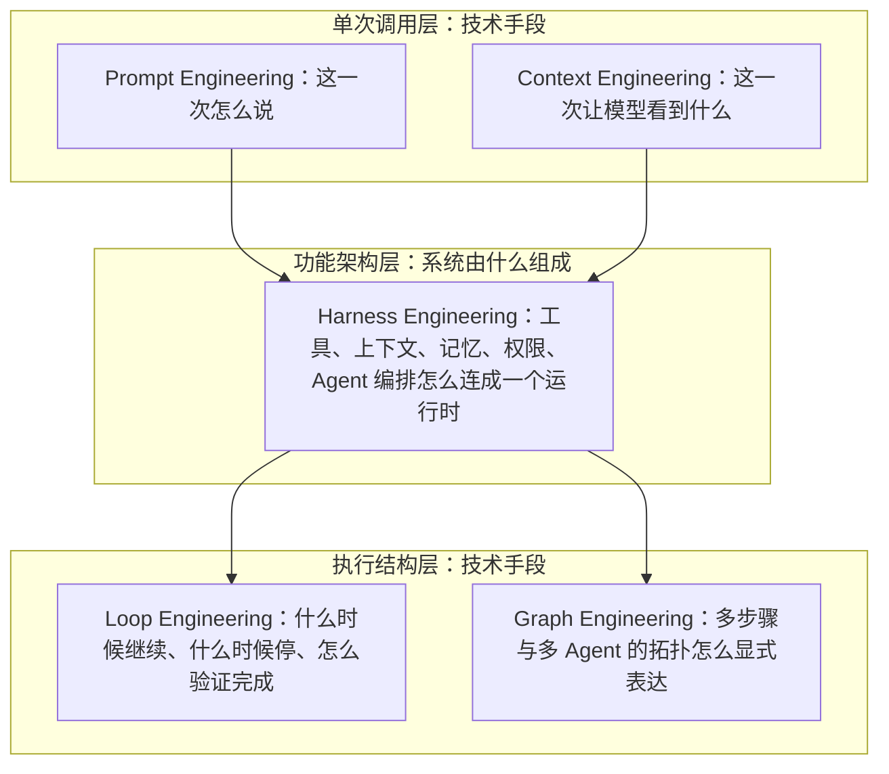

这张图想说的不是"Harness 比 Prompt 高级"，而是：Prompt 和 Context 讨论的是一次推理，Loop 和 Graph 讨论的是执行的时序与拓扑，而 Harness 讨论的是——这些东西凭什么能跑起来，跑的时候谁给它上下文、谁管它权限、结果存到哪里去。

用一个更直白的类比：Loop 像调度算法，Graph 像拓扑描述文件，Harness 是那个操作系统。

### 1.3 现在的解读大多偏理论，缺的是一张 AI Infra 的架构图

我读过的多数解读，讲到"Harness 是围绕模型构建的执行环境"就结束了。这句话没错，但对一个要动手做系统的人来说，它的信息量约等于零。

我真正想知道的是：这个执行环境里有几个模块？记忆和上下文是不是同一个东西？压缩在哪一层做？工具描述算不算上下文成本？子 Agent 回传什么？记忆服务挂了这一轮还能不能跑？

这些问题都不是理论问题，是架构问题。它们每一个都有若干种做法，每一种做法都有明确代价，选错了会在长任务里以很难 debug 的方式炸出来。

所以我这篇文章想补的就是这一块：不讲"Harness 意味着什么"，只讲"Harness 由什么组成、每个位置有哪些选项"。

### 1.4 我是工程背景，所以我只关心四件事：背景、输入、输出、怎么处理

我判断一件事有没有被讲清楚，用的是最老派的方法——能不能按 Input / Process / Output 说出来。

具体到 Harness，我关心的是四问：

- **背景**：为什么这件事到现在才被单独命名，它是被什么问题逼出来的；
- **输入**：一次 Agent 运行真正吃进去的东西有哪些，除了那句需求还有什么；
- **输出**：它最终交出来的到底是一段文字，还是一组产物加状态；
- **处理**：从需求到产物，中间经过哪些模块，哪些地方需要做策略选择，每种选择的代价是什么。

只要这四问能答完，一个名词对我来说就"落地"了。剩下的形容词都可以扔掉。

### 1.5 这篇文章的阅读地图

第 2 章给一个通俗定义：Agent = LLM + Harness，并用"帮我做一份 PPT"这个具体任务把 Harness 到底在管什么讲清楚。第 3 章用 Input / Process / Output 把系统拆开，给出全文最重要的一张主运行闭环图。

第 4 章和第 5 章处理两块最硬的地方：长短期记忆策略（分层、写入、召回、重排、预算、回写、兜底）和上下文工程（注入顺序、分层管理、压缩时机与手段、删除优先级、重新注入）。它们是长任务里最容易出事、也最能体现"同一个模型、不同 Harness、结果差很多"的地方。

第 6 章讲能力供给面：系统提示词、Tool Use、MCP 与 Skill 的分工、注册多少工具、工具怎么注入、Hooks 怎么用。第 7 章讲 Agent 架构选型，ReAct、Plan and Solve、Reflection 各自适合什么。第 8 章讲多智能体协作，拓扑、通信方式、回传形态和我坚持的三个原则。第 9 章讲安全沙箱与 Human in the Loop，也是我认为最需要产品来定策略的一层。第 10 章讲长程任务的三个痛点和三组解法，顺便说清 Loop Engineering 和 `/loop` 到底解决了什么、门槛在哪。第 11 章是一份可以直接拿去做架构评审的自检清单。

---

## 2 先下一个通俗定义：Agent = LLM + Harness

### 2.1 公式怎么读：LLM 是能力，Harness 是怎么用这个能力

如果只能用一行字解释 Agent，我会写成：

```text
Agent = LLM + Harness
```

先说清楚：**这是我用来理解 Agent 的工程心智模型，不是行业标准定义。** 它的价值不在于严谨，而在于它能立刻把责任切开——出了问题，你能判断该去调模型，还是该去改系统。

在这个公式里，LLM 负责"想"：理解需求、做推理、做判断、生成内容。Harness 负责"让它真的能干活"：给它准备上下文、暴露工具、执行调用、限制权限、保存状态、管理记忆、调度子 Agent、判断该不该继续。

这里要顺手纠正一个我经常听到的说法：LLM 不等于 API。API 只是我们访问模型的接口，模型能力才是那个"能力本身"。真正决定 Agent 好不好用的问题是——**在什么时候、带着什么上下文、开放哪些工具、以什么权限、调用哪一个模型，以及调用结束之后拿结果去干什么。**

这几个问题，一个都不属于模型，全部属于 Harness。

### 2.2 Harness 具体在管什么：以"帮我做一份 PPT"为例

假设用户丢过来一句："帮我研究一下 Harness Engineering，做一份 20 页的 PPT。"

一个真正能交付的系统，不会去做 `model.generate("帮我做 PPT")` 这种事。它至少要在四个地方做决策，而这四个决策全是 Harness 的活。

#### 2.2.1 什么时候调模型，调哪一次

这个任务里模型至少要被调用十几次，但不是每一步都该调模型。我把步骤分成两类：**需要语义判断的**，和**可以用代码写死的**。

比如"把用户这句话解析成 20 页的大纲"必须调模型；"根据大纲生成检索关键词"该调模型；"把抓回来的网页去掉导航栏和广告"用规则或者一个便宜的小模型就够了；"把最终文本渲染成 PPTX 文件"完全应该是代码，让模型去拼 XML 是自找麻烦。

这里有三种典型策略：

- **全模型驱动**：所有决策都问模型，包括"下一步该干什么"。灵活、能应付没预料到的情况，代价是贵、发散、不可复现，同一个需求跑两次流程可能完全不同。
- **流程全写死**：把研究、检索、写作、渲染定成固定管线。稳定、成本可算、好测试，代价是遇到需求变形就整条挂掉，比如用户中途说"重点讲一下安全沙箱"。
- **混合**：骨架用代码写死（研究 → 综述 → 生成 → 校验四个阶段固定），阶段内部的关键节点交给模型决策。

我更倾向第三种。我的经验是，一旦任务的阶段数超过三个，全模型驱动的失败模式会变得非常难查——你不知道它是这一轮判断错了，还是三轮之前就跑偏了。

#### 2.2.2 给模型配什么工具

同一个 PPT 任务，配一个 `web_search` 和配一整套 `search / fetch / read_file / write_file / run_command / render_pptx`，行为差别是巨大的。

工具设计上要做的选择主要有两个。第一个是**粒度**：细粒度工具（搜索、抓取、写文件分开）组合灵活，但完成一件事要多跑好几轮，轮数上去了上下文也就上去了；粗粒度工具（一个 `research_topic` 直接返回结构化结论）省轮次，但过程不可控，出错时你只知道"它失败了"。

第二个是**常驻还是按需**。所有工具的名字和描述都要写进上下文，这本身就在吃预算——十几个工具的 schema 很容易占掉几千 token。所以常见做法是：文件读写、搜索这类高频工具常驻；渲染、数据库、专用 MCP 工具按阶段挂载，进入生成阶段才把 `render_pptx` 暴露出来。

还有一类工具我认为价值被低估：**校验类工具**。比如"检查 PPTX 文件是否能被打开""检查每页字数是否超限"。它们不产出内容，但它们让"完成"变成一件可验证的事，而不是模型自己说完成了就完成了。

#### 2.2.3 资料回来太多了怎么办

这是最真实的场景：一次搜索返回 10 个结果，抓 5 个网页，每个 30 KB，一轮就把上下文吃掉一大截。

我见过的处理方式有四种，实际系统里往往同时用：

- **硬截断**：只保留前后各若干字符。最便宜、最可预测，缺点是可能刚好切掉那个关键数字。
- **规则抽取**：去掉导航、脚本、重复段落，只留正文和标题。成本几乎为零，但完全不理解语义。
- **小模型摘要**：调一个便宜模型压成"来源 + 核心结论 + 关键数字 + 原文位置"。语义保留得最好，代价是多一次调用的延迟和费用，而且摘要错了会被后续一路继承。
- **外置 + 指针**：原文写成文件，上下文里只留路径和一句话摘要，需要细节时再按路径回读。

我的默认选择是"规则抽取 + 外置 + 指针"，摘要只对那些确定要进最终产物的资料做。原因很简单：摘要是有损且不可逆的，而文件是可以回查的。

#### 2.2.4 要不要给主 Agent 配几个"小下手"

做 PPT 这种任务，很自然会想：能不能开五个子 Agent，一个查定义、一个查案例、一个查竞品、一个查数据、一个做提纲？

值得开子 Agent 的信号我总结成三条：**任务之间真的没有依赖**（可以并行）；**中间过程很脏但结论很短**（比如查一个数字要翻二十个网页，隔离掉这些垃圾上下文本身就是收益）；**失败可以整块丢弃重来**（子任务失败不污染主线）。

代价也很实在：通信有损耗，五个子 Agent 各自总结出来的口径可能互相矛盾，成本大概按并发数翻倍，出问题时排查链路变长。串行子 Agent 还会引入一个隐蔽问题——前一个的结论错了，后一个会在错误的基础上继续做。

顺便说一句，有人喜欢把这种主 Agent 加多个专长子 Agent 的结构类比成模型里的 MoE（混合专家，指按输入只激活部分专家网络）。这个类比只在"按需激活不同专长"这一点上成立，别真按 MoE 的路由逻辑去设计调度，两者的粒度和成本结构完全不一样。

### 2.3 所以 Harness 的工程本质：把工具 + 上下文 + 安全沙箱 + N 次模型调用连成一条能产出的流水线

把上面四个决策合起来看，Harness 的本质就很清楚了：**它是把工具、上下文、安全沙箱和 N 次模型调用连接起来，拼成一条能从 0 到 1 产出结果的流水线。**

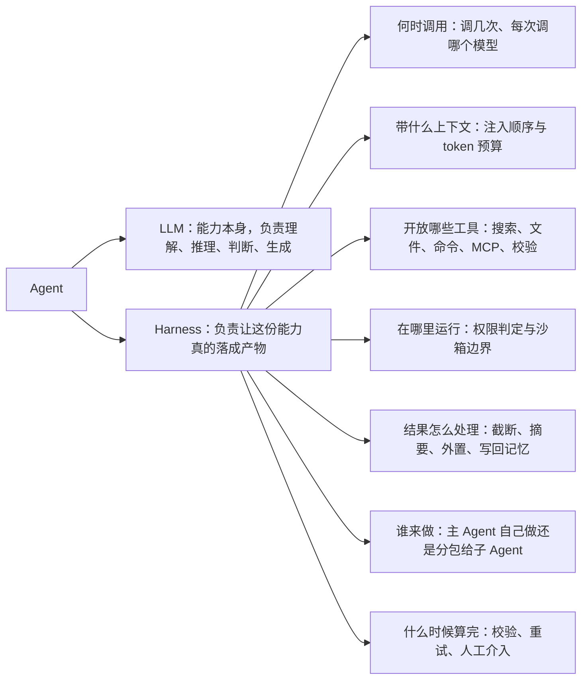

图右边这七条，每一条都是独立的策略位。同一个模型，这七个位置填不同的方案，得到的就是完全不同的产品——这也是为什么我说 Harness Engineering 更接近系统架构设计，而不是提示词技巧。

### 2.4 同一个模型，不同 Harness，结果差多少

这个问题很难有干净的对比数据，因为大多数产品不会公开自己的 harness 策略。但有一个我认为很有说服力的公开例子。

腾讯开源的 TencentDB Agent Memory 在处理长任务时，把详细执行过程转存到外部文件，上下文里只留一张任务地图——用节点和箭头表示状态流转，每个节点标上编号和下一步动作，要核对细节时按编号回查详细记录。据官方在 WideSearch 长任务基准上给出的数据，这个改动让 token 消耗从 2.21 亿降到 8500 万，通过率从 33% 提升到 50%（数据出自 Datawhale 对该项目的实测解读，微信公众号，2026 年 8 月）。

我想强调的不是这两个数字本身，而是它们的性质：模型没换，题目没换，变的只是"上下文里放什么"这一个 Harness 策略。成本降到不到四成，通过率还涨了一半。

<callout emoji="💡">
**这就是我认为 Harness 值得被单独当成一门工程来做的理由——它的杠杆率，在长任务上比换模型还高。**
</callout>

---

## 3 从工程视角拆解：背景、输入、输出、处理

### 3.1 背景：为什么这件事是现在才被单独命名的

我认为有三件事同时到位，才把这个名字逼出来。

第一是模型能力过了一个门槛：足够长的上下文、稳定的工具调用、还算靠谱的指令遵循。在模型连续调用三次工具就格式崩掉的时代，讨论 harness 架构是没有意义的。

第二是任务形态变了。以前的用法是一问一答，模型答完就结束；现在是"跨十几个文件改一个 bug""写一份带引用的调研报告"，一次任务要跑几十上百轮。轮数一多，瓶颈就从"模型聪不聪明"转移到"环境、上下文、状态管理有没有设计好"。

第三是产品差距被看见了。同样接一个主流模型，不同的编码 Agent、不同的深度研究产品完成率差得很明显。既然模型是同一个，那差的那部分就必须有个名字——这个名字就是 Harness。

### 3.2 输入：一个 Harness 真正吃进去的是什么

只要你把它当系统看，就会发现输入远不止用户那句话。我一般会列成七类：

- **用户目标与验收标准**：要什么、不要什么、什么算做完。这是最不能丢的一层。
- **系统策略**：角色定义、安全规则、输出规范、组织级约束。
- **工具清单与描述**：可用工具、参数 schema、使用注意事项。注意它同时也是上下文成本。
- **可访问的环境**：文件系统、代码仓库、网络、数据库、外部服务。环境的边界就是能力的边界。
- **记忆与历史**：长期偏好、历史结论、上一次会话留下的状态。
- **预算**：token 上限、时间上限、钱、最大轮数、最大并发。我认为预算必须当成显式输入，否则长任务只会以"撞墙"的方式结束。
- **权限与身份**：以谁的身份跑、哪些操作需要审批。

我踩过的坑是把预算和权限当成"运行时环境配置"而不是输入。结果是这两件事从来没有出现在任何决策里，模型完全不知道自己还剩多少余量，也不知道哪些动作需要先申请。

### 3.3 输出：它交出来的到底是什么

如果只把"最后那段文字"当输出，这个系统是没法运维的。我认为一次 Agent 运行的输出至少有五部分：**产物**（PPTX 文件、Markdown 报告、一组代码变更）、**执行摘要**（做了什么、用了哪些资料、哪几步失败过、哪些地方是推测）、**状态**（任务地图跑到哪、哪些节点已完成、哪些被跳过）。

有了状态，任务才能被中断和续跑。第四部分是**记忆增量**：这次运行值得沉淀下来的偏好、结论和规则。第五部分是**可观测数据**：调用次数、token 消耗、耗时、失败原因分布——这部分不给用户看，给做系统的人看，没有它你无法判断一次改动是变好了还是变差了。

### 3.4 处理：一次完整的 Agent 运行是怎么流转的

下面这张是全文最重要的图，它把前面说的所有模块串成一个闭环。

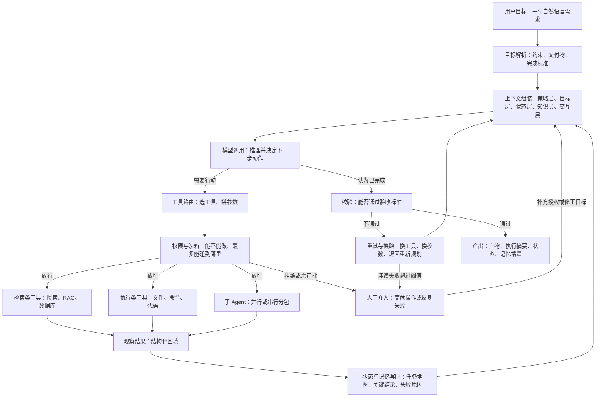

这张图里我认为最容易被漏掉的是三条边：`观察结果 → 状态与记忆写回 → 上下文组装` 这条回路（决定了下一轮看到什么）、`校验不通过 → 重试与换路` 这条边（决定了系统能不能自己爬出坑），以及 `连续失败超过阈值 → 人工介入` 这条边（决定了系统会不会在原地烧钱）。

很多号称 Agent 的实现其实只有 `上下文组装 → 模型调用 → 工具 → 观察` 这一小圈，没有校验、没有状态写回、没有失败退出条件。它能跑 demo，跑不了长任务。

### 3.5 所以一个 Harness 至少要有这几块（全文总览图）

把上图按职责归并，我认为一个能用的 Harness 至少要有八块。下面这张表是我做架构评审时用的清单，第三列特别重要——每一块缺失时的表现是不一样的，可以反过来定位问题。

| 模块 | 它管什么 | 缺失时的典型表现 |
|-|-|-|
| 目标与任务管理 | 拆解目标、维护任务地图、定义完成标准 | 跑到一半忘了要交什么，中途改需求就全乱 |
| 上下文管理 | 分层、注入顺序、压缩、重新注入 | 二十轮后爆上下文，或者越跑越笨 |
| 记忆系统 | 长短期分层、写入、召回、回写 | 每次会话都要重新解释一遍偏好 |
| 工具层 | 工具定义、粒度、按需挂载、结果规整 | 工具描述吃掉大半预算，或者模型总选错工具 |
| 权限与沙箱 | 能不能做、最多能碰到哪里 | 一次误删就是生产事故 |
| 多 Agent 编排 | 何时分包、怎么通信、回传什么 | 子 Agent 结论互相矛盾，成本失控 |
| 长程续跑 | 状态持久化、断点恢复、进度对齐 | 断了就得从头来 |
| 校验与观测 | 验收、重试、trace、成本统计 | 模型说完成就算完成，改动效果无法评估 |

前四块是"让它能跑"，后四块是"让它能被信任地跑"。接下来我按这张表的顺序往下拆，先从最吃工程功力的两块开始——记忆和上下文。

---

## 4 长短期记忆策略

### 4.1 记忆要不要分层，分几层

先分清一件事：上下文是这一轮模型能直接看到的，记忆是系统在需要时能重新找回来的。不分层的记忆系统，实际上就是把聊天记录当记忆——短会话没问题，长会话必炸。

常见的分层方案有四种：

- **不分层**：全量历史，按时间截断。零成本、零复杂度，代价是想调出"三周前用户说过不吃香菜"这种事完全靠运气。
- **两层**：短期会话 + 长期档案。实现简单，是我认为大多数应用的合理起点。代价是长期档案会越写越杂，最后变成一个没人敢删的大文本。
- **三层**：原始记录 + 结构化事实 + 长期画像。多了一层"提炼"，检索质量明显变好，代价是要维护提炼链路。
- **四层金字塔**：在三层之上再加一层"场景聚合"。

腾讯开源的 TencentDB Agent Memory 用的就是四层：L0 是原始对话流水账，毫秒级落盘、一字不改；L1 是记忆卡片，由后台调模型提炼出偏好、事件、规则三类结构化事实，带优先级；L2 是场景档案，把同情境的卡片打包，带一个热度值，命中一次就加一；L3 是人格摘要，是唯一无条件注入、不需要检索的一层（该项目细节出自 Datawhale 的实测解读文章，微信公众号，2026 年 8 月）。

L3 那个设计我特别认同：因为它无条件注入，所以它必须短而且稳定。一旦让人格摘要频繁变化，它就会把整个稳定前缀的缓存打掉——这一点在 4.3 会展开。

我的选型判断是：单轮工具型应用两层就够；有持续人格、跨会话偏好的助手类产品，三层是底线；只有当你真的有多场景（工作、生活、编码分开）且需要按场景导航时，第四层才划得来。

### 4.2 层级之间如何交互与写入

层与层之间的关系是"提炼"，不是"复制"。原始记录提炼成结构化事实，结构化事实按情境聚合成场景档案，场景档案再抽象成长期画像。方向是单向的，越往上越短、越稳定、越贵。

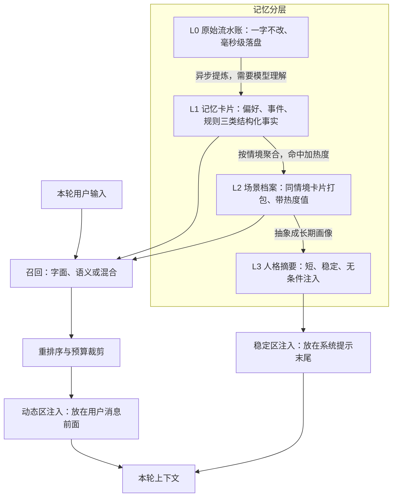

写入策略上有三个选项。**同步写**：这一轮说完立刻提炼入库，好处是马上可检索，代价是每轮都要多等一次模型调用。**异步写**：先落盘保证不丢，提炼放后台跑。**纯批量写**：会话结束才提炼，最省，但会话内完全无记忆可用。

上面那个项目走的是两段式：原始对话毫秒级落盘保证不丢，提炼异步在后台跑，实测大约 6 秒后卡片才可被检索。这 6 秒的可见性延迟是必须接受的代价——我倾向于接受，因为同步提炼会把每一轮的首字延迟都拖长。

至于什么时候触发提炼，它的默认条件是每满 5 轮对话或者停止输入 10 分钟，也支持手动触发，并且新会话有预热机制（1 轮、2 轮、4 轮递增）。预热这个细节很实用：新会话前几轮信息密度最高，等满 5 轮才提炼就太晚了。

为什么提炼这一步非要调模型？因为区分"我不吃香菜"是长期偏好、"今天中午吃了火锅"是一次性事件，靠规则和关键词做不到——两句话的句式几乎一样，差别只在语义。这是我认为记忆系统里最没法省模型调用的一处。

### 4.3 怎么拼接系统提示：哪些无条件注入，哪些按需召回

拼系统提示不是字符串拼接，是一个预算和缓存的联合决策。我的分法很简单：**几轮才变一次的放系统提示末尾，每轮都变的放用户消息前面。**

具体来说，人格摘要、场景导航、工具指南属于前者；本轮动态召回的记忆卡片属于后者。

为什么要分开放？因为模型服务商会对稳定前缀做 KV cache（把已经算过的前缀的中间状态缓存下来，下次命中就不用重算）。把每轮都变的召回结果塞进系统提示，等于每轮都改前缀，缓存直接失效，token 消耗和延迟一起上升。

上面提到的那个项目就是这么做的：本轮召回的卡片放用户消息前面，人格摘要、场景导航、工具指南放系统提示末尾。同时它给注入加了三道闸——5 秒超时保护、单条长度上限、本轮总字符上限，另外在提示词里软约束"每轮主动检索不超过 3 次"。

我很喜欢最后这条软约束。检索次数是模型自己决定的，硬拦会打断它的推理，写进提示里做软约束是成本最低的控制手段。

### 4.4 要不要做 RAG，做哪一种 RAG

RAG（检索增强生成，即先检索再把资料喂给模型）不是一个选项，是五个选项。我的判断是：先看数据形态，再决定用哪一种，不要默认上向量库。

#### 4.4.1 向量检索

把文本转成 embedding（向量表示，字面不重叠也能算出语义相近），按相似度召回。

优点是能跨措辞、跨语言召回，用户说"辣的不行"也能命中"不吃香菜"这类记忆。代价是要额外部署或调用一个 embedding 模型服务，索引要维护，而且它对精确匹配很不友好——查一个具体的错误码或者函数名，向量检索经常给你一堆"看起来相关"的东西。

#### 4.4.2 语义 / 关键词字面匹配

全文索引加上关键词稀有度打分（越少见的词命中时权重越高）。快、便宜、结果可解释，是我在任何项目里都会先上的一条路。

它的死板之处在于换个说法就召不回来。还有一个很隐蔽的坑：卡片总量少的时候，稀有度分数会失真——语料只有几十条时，几乎每个词都是"稀有词"，打分就没有区分度了。

#### 4.4.3 SQL / 结构化查询

如果你要回答的是"上个月一共提交了多少个 MR""这个用户设置过哪些偏好项"，那答案在数据库里，不在向量里。

这类问题必须走 SQL 或者结构化查询，代价是要维护 schema 和查询模板，收益是结果精确、可核对、可复现。我的原则是：凡是涉及计数、聚合、时间范围、精确过滤的问题，一律不要交给相似度检索。

#### 4.4.4 GraphRAG

把实体和关系建成图再检索，适合回答"多跳"问题：A 依赖 B，B 上周被 C 改过，所以 A 现在为什么挂了。

代价很实在：抽实体、抽关系要调模型，图要更新维护，构建成本明显高于前三种。我的建议是等到确实出现了"两三跳才能答上来的问题"再上，不要一开始就上图。

#### 4.4.5 CodeGraph

代码仓库问答场景下，我认为它比向量检索重要得多。把符号定义、引用、调用关系、文件依赖建成图，问"这个函数被谁调用了"能给出精确答案，而不是几段相似的代码片段。

典型场景是"跨十几个文件改一个 bug"：向量检索会给你十段长得像的代码，CodeGraph 能给你真正的调用链。代价是要跟语言的解析工具链绑定，多语言仓库的维护成本不低。

### 4.5 怎么召回，怎么重排序

召回和重排是两件事：召回负责"别漏"，重排负责"别乱"。

多路召回之后要做融合，这里有个细节值得注意：两套打分体系的原始分数不能直接比大小——字面匹配的稀有度分和向量的余弦相似度，量纲完全不同。所以通常的做法是只看名次不看分数，用排名叠加来融合。上面那个项目的混合检索就是这么做的。

重排序我常用的有三种：**规则加权**（按热度、时间衰减、优先级调整顺序，最便宜，也最好解释）；**小模型判相关**（让一个 lite model 对候选逐条打"相关不相关"，准但慢）；**交叉编码器重排**（效果最好，需要额外模型服务）。

这里我要专门说一个非常典型的坑。那个项目的默认策略是混合检索，但语义能力默认关闭——两者叠加的结果是零配置下实际降级成纯关键词检索。

<callout emoji="💡">
我的判断是：**任何"默认开启 A 策略 + A 依赖的能力默认关闭"的组合，都是事故温床。** 更稳的做法是启动时做能力探测，探测不到就在日志里明确告诉使用者"当前实际生效的是关键词检索"，而不是静默降级。
</callout>

### 4.6 双路径：lite model 保语义，embedding 保广度

我比较看好一种双路径设计：一条路用便宜的小模型做语义理解，一条路用 embedding 做广度覆盖。

**lite model 路径**擅长的是判断，比如"这句话是长期偏好还是一次性事件""这条老卡片和新卡片是不是同一件事"。它的优势是能给出带理由的判断，缺点是每次都要调用，扫全库不可能。

**embedding 路径**擅长的是筛选，几万条卡片里挑出最像的 20 条，成本几乎可以忽略。缺点是它只会说"像"，不会说"为什么像"，也判断不了"矛盾"。

组合方式我倾向于：embedding 负责从全量里粗筛，lite model 只在粗筛结果上做精判和仲裁。这样模型调用次数被压在常数量级，语义判断能力又保住了。反过来（先用小模型再用向量）在成本上根本不可行。

### 4.7 不同层级怎么划分 token 预算

不做预算划分，最后一定是某一层把别人挤死。我一般给每一层设两个数：一个硬上限，一个软目标。

一个可以直接抄的分配思路是：人格摘要这类无条件注入的内容压在几百字以内，绝对不能随会话增长；本轮召回的卡片限定条数（3 到 5 条）加单条长度上限，再加一个本轮总字符上限；任务状态占固定份额；知识和资料层做弹性，剩多少用多少。

关键是要有优先级：预算不够时先砍知识层，再砍交互历史，最后才动目标和状态。要注意的是工具描述也是要算进预算的，十几个工具的 schema 常常比你以为的贵得多。

同时留一个软约束：在提示词里限制每轮主动检索的次数。硬上限防爆，软约束防浪费，两个一起用。

### 4.8 服务端要不要维护，怎么更新回写

这里有两种架构。**客户端自己拼**：应用负责存储、召回、拼接，灵活、无外部依赖，但每个应用都要重写一遍，多端之间的记忆也不共享。**服务端托管**：记忆作为独立服务，多端共享、可以后台异步提炼、能统一做去重和仲裁，代价是多一个依赖、多一次网络往返，还要处理服务不可用的情况。

我倾向服务端托管，理由是提炼和回写这两件事天然适合放后台，放在请求链路里一定会拖延迟。

回写最难的不是写，是**冲突仲裁**。那个项目的做法是两阶段：第一阶段不调模型，先做候选召回（语义指纹优先，不可用就降级关键词，都不可用就跳过）；第二阶段把新卡片和召回到的老卡片一起交给模型，判断是新增、跳过、覆盖还是合并。

这个设计的关键限制必须说清楚：**模型只能在召回到的候选里做判断，没召回到的老卡片在它眼里等于不存在。** 也就是说，仲裁质量的上限由第一阶段的召回质量决定，第一阶段漏了，第二阶段再聪明也补不回来。

还有一个更根本的问题：字面矛盾并不等于逻辑矛盾。"必须用 PostgreSQL"和"改用 MySQL"这两条至少有三种解释——用户改主意了、这是两个不同项目、或者用户自己前后不一致。第三种情况我认为就该留给人判断，系统不要自作聪明地覆盖。

### 4.9 兜底：记忆系统挂了不能把对话拖死

我认为记忆系统的第一原则是**故障容忍优先于功能完整**。记忆是增益，不是主链路，不能因为它挂了就让整个对话不能用。

具体的兜底策略：检索两路都不可用就返回空结果；去重判断超时就全部当新卡片存；召回超时就跳过本轮注入；注入整体加超时保护。最坏情况是这一轮没有记忆可用，但对话能继续往下走。

这套原则我认为可以直接套到 Harness 的其他模块上：任何"锦上添花"的能力都必须能优雅降级，只有目标、任务状态和权限判定是不能降级的。

### 4.10 记忆策略选型清单

把上面的选择合并成一张表，供做架构决策时对着挑。

| 做法 | 怎么做 | 优点 | 代价 | 适合场景 |
|-|-|-|-|-|
| 不分层全量历史 | 按时间窗口截断聊天记录 | 零成本、零维护 | 长会话必爆、无跨会话记忆 | 单轮或短会话工具 |
| 两层：会话 + 档案 | 会话结束提炼进一份长期档案 | 实现简单、见效快 | 档案越写越杂、检索质量下降 | 大多数应用的起点 |
| 四层金字塔 | 原始流水账加卡片加场景加人格 | 检索精准、注入可控 | 要维护提炼链路和冲突仲裁 | 长期人格型助手 |
| 纯关键词检索 | 全文索引加稀有度打分 | 快、便宜、可解释 | 换措辞就召不回、小语料打分失真 | 冷启动、精确名词查询 |
| 纯向量检索 | embedding 相似度召回 | 跨措辞跨语言、广度好 | 需额外模型服务、精确匹配弱 | 偏好类、经验类记忆 |
| 混合检索加排名融合 | 两路并行、只按名次叠加 | 兼顾精确与广度 | 要处理能力缺失时的降级提示 | 生产环境默认方案 |
| GraphRAG | 抽实体关系建图后多跳检索 | 能答多跳因果问题 | 构建和更新成本最高 | 依赖关系复杂的领域 |
| CodeGraph | 建符号、引用、调用图 | 代码问答精确、能给调用链 | 绑定语言工具链 | 仓库问答、跨文件改动 |
| SQL 结构化查询 | 模板化查询业务表 | 精确、可核对、可复现 | 要维护 schema 与模板 | 计数、聚合、时间范围类问题 |
| 同步写入 | 当轮提炼当轮可查 | 无可见性延迟 | 每轮多一次模型调用延迟 | 强依赖即时记忆的短流程 |
| 两段式异步写入 | 原始落盘加后台提炼 | 不丢数据、不拖延迟 | 有数秒可见性延迟 | 我的默认选择 |

---

## 5 上下文工程：注入顺序、分层管理与压缩

### 5.1 上下文注入顺序：为什么顺序本身就是性能问题

很多人以为上下文只要"信息都在里面"就行，顺序无所谓。我的判断正好相反：**顺序本身就是一个性能问题，同时也是一个正确性问题。**

一个比较稳妥的顺序是这样：


不用死记这个顺序，记住背后那条原则就够了：**稳定、强约束的信息靠前，动态、临时、易变的信息靠后。**

它带来三个具体好处。一是缓存：前面越稳定，KV cache 命中率越高，token 和延迟一起降。二是约束优先级：后出现的指令通常更容易覆盖先出现的，所以真正不能违反的策略放最前，而"这一轮该干什么"放最后。三是可诊断性：顺序固定之后，同一个 bug 才有复现的可能。

我踩过的坑是把每轮都变的召回结果拼进系统提示的中段。功能上完全正常，成本上很难看——每一轮的前缀都不一样，缓存等于没有。

### 5.2 上下文要不要分层管理，分几层

不分层的后果是，压缩的时候你不知道该删哪个。分层的意义就是给每一段信息标上"生命周期"和"可丢弃程度"。

我一般分五层：

- **L0 策略层**：安全规则、组织约束、输出规范。整个会话不能丢。
- **L1 目标层**：用户目标、交付物、验收标准。不能丢，压缩时最后才动。
- **L2 状态层**：任务地图、当前进度、依赖关系。必须显式维护，不能靠从聊天记录里推断。
- **L3 知识层**：记忆、检索资料、文件内容、数据库结果。按需召回、按需丢弃。
- **L4 交互层**：近期对话和工具输出。膨胀最快，也应该最先被清理。

分几层取决于任务长度。短任务三层就够（策略、目标、交互）；只要任务会跑到十轮以上，L2 状态层就必须独立出来——长任务失败最常见的原因不是模型不聪明，是它忘了自己做到哪一步了。

### 5.3 什么时候压缩

压缩时机有两种风格。**被动式**：撞到上下文上限才压。实现最简单，代价是它一定会在最糟糕的时候触发——通常是任务跑到最深、上下文最有价值的那一刻。**主动式**：按阈值提前压。

我倾向主动式，触发条件通常是这几类的组合：

- **占用比例**：达到窗口的 70% 到 80% 就开始压，留出余量给下一轮工具输出。
- **单条体积**：某一次工具输出超过阈值就地处理，不等到总量超标。
- **阶段切换**：从研究切到写作、从规划切到执行，这时候前一阶段的过程数据大部分都可以归档。
- **轮次**：每 N 轮做一次例行整理。
- **失败之后**：一串失败重试会留下大量重复的错误堆栈，值得单独压一次。

如果你的 harness 提供 hook 机制（在固定事件点插入自定义处理，比如 Claude Code 的 `PreToolUse`、`PostToolUse`、`Stop` 这几个官方事件），那规则压缩最自然的挂点就是 `PostToolUse`——工具刚返回、内容还没进上下文的时候处理，成本最低。

### 5.4 怎么压缩：四种做法

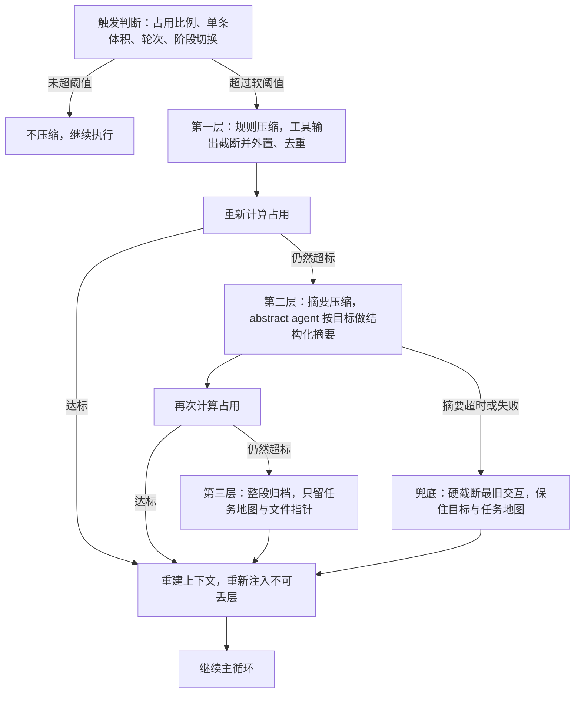

这张图的重点是：压缩是分层递进的，而且每一层之后都要重新算一次占用，不要一上来就调模型做摘要。下面四种做法对应图里的各层。

#### 5.4.1 脚本 / 规则压缩

不调模型，纯代码处理。比如工具输出超过 10k token 就只留前后各 500 token，原文写文件，上下文里只留路径；网页去掉导航和脚本；重复的错误堆栈折叠成一行加次数。

优点是便宜、可预测、稳定，而且完全可复现。缺点是它不理解语义，可能把关键那一段切掉。我的做法是把它当第一层默认策略，永远开着。

#### 5.4.2 abstract agent 摘要压缩

用一个专门的便宜模型把历史压成结构化摘要，通常是"已完成的事 / 关键结论 / 关键数字 / 待办 / 不要再犯的错"这几个字段。

优点是语义保留最好，而且可以按当前目标来压——同一段历史，做 PPT 和查 bug 需要留下的东西不一样。代价有两个：多一次调用的延迟和费用；更麻烦的是**摘要错误会被后续一路继承**，而且很难发现。我的经验是给摘要固定字段模板，不要让它自由发挥，自由发挥的摘要丢东西的概率高得多。

#### 5.4.3 直接截断

按窗口滑动，丢掉最旧的交互。最简单、零成本、零延迟。代价是它完全不看内容，可能把关键决策丢了。

我认为它不该作为主策略，但必须作为兜底策略存在——当摘要模型超时或者报错时，系统得有一条保证能往下跑的路。

#### 5.4.4 外置文件 + 任务地图

这条路我认为在长任务上收益最大：**别把 session 等同于 context window。** 完整的执行过程持久化到外部文件，上下文里只留一张任务地图。

任务地图的形态是用节点和箭头表示状态流转，每个节点标上编号和下一步动作，需要核对细节时按编号回查详细记录。前面提到的那个开源项目在 WideSearch 长任务基准上给出的数据是：token 消耗从 2.21 亿降到 8500 万，通过率从 33% 提升到 50%（数据出自 Datawhale 的实测解读，微信公众号，2026 年 8 月）。

我特别想强调"通过率还涨了"这一点。直觉上压缩是有损的，应该以精度换成本；但在长任务里，噪声本身就在伤害精度——上下文里堆满二十轮之前的工具输出，模型的注意力会被稀释。所以压得对，是双赢。

### 5.5 压缩策略：删除优先级和去重

压缩最核心的其实不是"怎么压"，而是"先删谁"。我用的优先级是从"过程"往"结论"删：

| 优先级 | 删什么 | 怎么做 | 优点 | 代价 | 适合场景 |
|-|-|-|-|-|-|
| 1 | 大体积工具输出 | 只留来源、核心结论、关键数字、原文位置，原文外置 | 一次就能腾出最大空间 | 需要回查时多一次读文件 | 检索、爬取、日志类任务 |
| 2 | 工具调用参数与重复调用 | 同参数重复调用折叠为一条加次数 | 无信息损失 | 需要记录调用指纹 | 重试较多的执行任务 |
| 3 | 任务级 thinking 与推理过程 | 只保留最终结论与依据，过程丢弃 | 减量明显 | 后续无法复盘推理路径 | 已确认结论的阶段 |
| 4 | 失败路径细节 | 只留尝试了什么、为何失败、下次别做什么 | 避免重复犯错又省空间 | 丢失完整错误现场 | 长时间重试后 |
| 5 | 已完成子任务的过程 | 压成任务编号、状态、产物路径、关键结论 | 状态清晰 | 细节需按编号回查 | 多阶段长任务 |
| 6 | 主会话与用户目标 | 最后才动，且只做措辞级精简 | 保住任务不跑偏 | 几乎不可压 | 极端情况 |

去重是另一件必须做的事，而且它经常比截断更有效。典型的重复形态是：搜索结果 A 在上下文里，主 Agent 对 A 的总结也在，子 Agent 对 A 的总结也在，最后主 Agent 汇报时又复述了一遍——同一份信息四份副本。

去重的做法有三档：URL 或文件路径级去重（最便宜，先做）、内容哈希或指纹去重（能抓到同一段文本的多次读取）、语义去重（要调模型或用 embedding 比相似度，最准也最贵）。我的顺序是前两档常开，语义去重只在压缩阶段跑一次。

### 5.6 什么时候需要重新注入：压缩后、换模式、换模型

压缩之后上下文是被重建过的，所以有些东西必须重新注入，否则会出现最难查的一类 bug——模型行为在第 20 轮之后突然变了，因为某条约束在压缩时被删掉了。

需要重新注入的场景我列成一张清单：

- **压缩之后**：策略层、目标层、任务地图必须重新注入。这三样是不可丢层。
- **换模式**：从规划模式切到执行模式、从研究切到写作，操作约束和输出契约都变了，要重新注入对应的规则。
- **换模型**：不同模型对格式、工具调用的偏好不一样，而且换模型意味着缓存前缀完全失效，正好是重建上下文的时机。
- **启动子 Agent**：子 Agent 拿到的是一份新上下文，策略、权限和它那一小块目标都要显式注入，不要指望它从主 Agent 的历史里推断。
- **会话恢复**：断点续跑时要把状态层重新拼回来。
- **进入新阶段**：阶段专属的工具指南和验收标准按需挂载。

值得一提的是，系统提示在很多实现里不属于普通消息历史，所以压缩之后它本身还在；但那些"通过读文件加载进来的规则"（比如项目级说明文件、路径级规则）是普通消息，压缩后就没了，必须重新读一遍。这个差别很容易被忽略。

### 5.7 压缩分几层，以及兜底措施

我倾向的结构是三层加一个兜底：

第一层是规则压缩，常开、零模型调用，处理体积问题。第二层是摘要压缩，按需触发，处理语义收敛问题。第三层是整段归档，把已完成阶段整体挪到外部文件，上下文里只留任务地图和指针。

兜底是第四条路：硬截断。它的存在意义是保证"压缩这一步本身不会成为故障点"。摘要模型超时、外部存储写失败、归档任务异常，都不能让主循环停下来。

兜底要遵守的规则我总结成三条：

- **保底不可丢**：任何兜底路径都必须保留策略层、目标层和任务地图，宁可把最近十轮对话全丢掉。
- **有损必可回查**：所有被压掉的原文都要落在外部文件里，并且上下文中留下可定位的编号或路径。压缩允许有损，但不允许不可追溯。
- **降级要可见**：一旦走了兜底路径，要在执行摘要或者日志里明确写出来。静默降级最可怕——系统看起来在正常运行，实际上已经在用一份残缺的上下文做决策了。

前面讲完了记忆和上下文，接下来这几章是 Harness 里"最工程"的部分：模型手上有什么能力、怎么安全地交出去、什么时候需要一群 Agent、任务长到几十个 task 时怎么不塌。

---

## 6 工具与能力供给：系统提示词、Tool Use、MCP、Skill、Hooks

这一章讲 Harness 的**能力供给面**：系统提示词决定模型"按什么规矩工作"，工具决定它"能碰到哪些真实世界的东西"，MCP 决定"接得上多少外部系统"，Skill 决定"会不会用"，Hooks 决定"关键节点上系统必须自动做什么"。

这一层最容易被低估。很多团队一上手就堆工具、接 MCP，结果表现反而变差。原因很简单：**能力供给不是免费的，每一项都占上下文、占决策带宽、占出错概率。**

### 6.1 系统提示词：Harness 里最便宜也最容易被写坏的一层

系统提示词是常驻成本，每轮都在花 token，也每轮都在影响模型的行为分布，所以它是 Harness 里改动成本最低、杠杆最大的一层。

我见过的写法大致三种：

- **薄提示词**：只写角色、目标、几条硬约束，其余靠工具描述和 Skill 自带说明。便宜、迁移性好，但行为下限低。
- **厚提示词**：把领域知识、格式规范、常见坑、示例全塞进去。短期效果好，代价是常驻 token 高、条目互相冲突。
- **分层提示词**：拆成"策略层（安全红线）+ 角色层（工作方式）+ 契约层（输出格式与完成标准）+ 环境层（工作目录、日期）"，只有前三层常驻，环境层每轮重建，领域知识外置到 Skill。

我倾向第三种。判断标准是：**这段文字如果只有 5% 的任务会用到，它就不该待在系统提示词里。** 比如"PPT 每页标题不超过 14 个字"这类规则，写进系统提示词等于让写代码、查数据的任务也为它付费；放进 PPT Skill，只有要做 PPT 时才加载。

我踩过的坑主要是**规则互相打架**："未经确认不要改用户文件"和"发现问题应主动修复"同时存在，模型只能二选一，行为就不可预测。另一个坑是把提示词当兜底，出一次 bug 加一句"不要犯这个错"——这种事该用 Hooks 做确定性检查。

### 6.2 Tool Use：工具的本质是把不确定性外包给确定性系统

工具的价值不在"扩展能力边界"，而在**把模型不擅长的事交给确定性系统**。让模型口算 12 万行 CSV 的分位数，它会给一个看着合理但错的数；让它写五行 pandas 跑一遍就是对的。工具的意义是把"生成一个答案"换成"生成一段能被执行、能被验证的指令"。

工具设计上我关心四件事：

1. **粒度**。粗粒度工具（`run_bash`）表达力强但难约束，细粒度工具（`read_file` / `edit_file` / `run_tests`）好审计、好拦截、好回滚。我的做法是核心动作细粒度化，只保留一个受限 shell 作逃生通道。
2. **返回裁剪**。一次 `grep` 命中 4000 行不能直接回灌，要么截断加计数，要么落盘只回指针。裁剪策略属于 Harness，不属于工具本身。
3. **错误信息可自愈**。返回 `Error: invalid argument` 等于什么都没说；返回"字段 date 需要 YYYY-MM-DD，你传的是 2026/03/01，可用字段有 date、created_at"，模型下一轮几乎一定改对。**工具的错误信息是写给模型看的提示词，不是写给 SRE 看的日志。**
4. **幂等与可回滚**。长任务一定会重试，写文件类工具最好做到同参数重复执行结果一致，破坏性动作先备份或走版本控制。

### 6.3 MCP 和 Skill 的分工

这两个概念经常被混着讲，但解决的是不同问题。我的区分很简单：**MCP 解决"接得上"，Skill 解决"会不会用"。**

#### 6.3.1 MCP 解决的是"接得上"

MCP 是连接外部工具与数据源的标准接口协议，价值是把"每接一个系统写一套适配层"变成"实现一次协议、到处复用"，官方文档对它的定位也是让 Claude Code 访问外部工具、数据库和 API。所以 MCP 带来的是**连接性**：GitHub、Jira、数据库、监控告警、内部工单。它不负责告诉模型"面对线上告警该按什么顺序排查"，只负责让模型能读到告警、查到日志。

代价也实在：每接一个 Server，它暴露的所有工具名和 schema 都会进上下文，一个功能齐全的数据库 MCP 可能带来二十几个工具，大部分任务用不到。

#### 6.3.2 Skill 解决的是"会不会用"

Skill 更像一份**可复用的任务知识包**：这类任务的步骤、边界、常见坑、要调哪些工具、产出长什么样，外加脚本、模板、示例这些配套资源。它可以按需加载，也可以交给 Sub Agent 执行，官方文档里 Skill 的加载方式本身就带渐进披露的思路。

一句话说清区别：**MCP 给的是"手能伸到哪"，Skill 给的是"手该怎么动"。** 只有 MCP 没有 Skill 的 Agent，能连上文档 API，但每次写文档的排版都不一样。

#### 6.3.3 我的选择标准

我判断一个能力该做成 Tool、MCP 还是 Skill，就问三个问题：

| 问题 | 答"是"→ | 理由 |
|-|-|-|
| 它是一个原子动作，有明确输入输出吗 | 做成 Tool | 好拦截、好审计、好重试 |
| 它是对接已有外部系统，且别的 Agent 也要用吗 | 做成 MCP | 协议化一次，复用多处 |
| 它是一套"怎么做"的流程知识，本身不执行动作吗 | 做成 Skill | 按需加载，不占常驻上下文 |

三个都沾一点的能力（比如"生成月度经营报告"）我会做成 **Skill 包住 MCP 和 Tool**：Skill 描述流程与验收标准，内部调用数仓 MCP 取数、调用文件工具落盘。

### 6.4 注册多少工具：工具数量是有代价的

假设注册了 300 个工具且 schema 全进上下文，会同时发生三件坏事：常驻 token 涨到几万；工具选择变成一道 300 选 1 的题，错误率明显上升；语义相近的工具（`search_docs` / `find_document` / `query_knowledge`）互相干扰，模型开始随机挑。

我大致按数量分档：

- **10 个以内**：全量注入，任何路由机制的收益都小于它引入的复杂度。
- **10 到 50 个**：按域分组，只注入当前任务相关的组。代码仓库问答只给检索和读文件，不给部署和写库。
- **50 个以上**：必须做工具目录加检索，主 Agent 只留"常驻核心工具 + 一个查工具的工具"。

还有个朴素信号：**你自己都要翻文档才能说清两个工具的区别，模型一定会搞混。**

### 6.5 工具如何注入：必定注入、按需加载、lite model 预扫描

工具注入本质上是预算分配：常驻的保证 Agent 永远不会手足无措，按需的保证上下文不被 schema 吃掉。

#### 6.5.1 哪些工具必定注入

我的清单很短，只放**没有它 Agent 就无法自我推进**的能力：读写文件与列目录（认识环境的眼睛）、任务地图读写（长任务的命脉）、一个受限的执行入口、记忆读写与检索、一个"查工具、加载能力"的元工具。最后这项是兜底：只要它在，即使按需加载判错了，Agent 也能自己把缺的能力捞回来，而不是在上下文里编一个不存在的函数名。

#### 6.5.2 哪些工具按需加载

判断标准是三个"高"：**schema 高开销、使用频率低、风险高**。典型的按需工具是数据库写入、生产部署、支付、发邮件、Figma、报表系统，以及各种领域 MCP。触发方式可以是任务类型匹配（用户提到"部署"）、显式声明（Skill 里写明可用工具）、阶段驱动（进入交付阶段才加载发布工具）。

按需加载的代价是**召回失败**：任务其实需要某个工具但没被加载，模型会退化成用现有工具硬凑，甚至直接说"我做不到"。所以必须配恢复路径：元工具，或一次显式的能力重扫描。

#### 6.5.3 要不要让 lite model 先扫一遍可用工具

这是个很实际的选择题，大致三条路：

- **规则或检索路由**：关键词加向量检索在工具目录里选 5 到 10 个候选注入。最便宜、延迟最低，但"用户说人话、工具名很技术"时召回差。
- **lite model 预扫描**：把任务和工具目录摘要丢给便宜模型，让它输出候选集再注入主模型。语义理解好，成本只是一次小调用；代价是多一次往返，它选错时主 Agent 是"不知道自己不知道"。
- **主模型自助检索**：不预扫，只给 `search_tools` 和 `load_tool` 让主 Agent 自己捞。最准，因为决策者掌握全部上下文；代价是多耗一到两轮。

我的判断是：工具少于 50 个别做预扫描，收益覆盖不了延迟和一致性风险；超过 50 且任务类型可枚举，用检索路由加元工具兜底；只有工具池特别大、任务表述又特别口语化时，预扫描才真的划算。而且预扫描**只做加法不做减法**。

### 6.6 Hooks：把确定性规则挂回不确定的模型

Hooks 解决一个很明确的问题：**某个事件发生时系统必须自动做什么，不依赖模型的自觉。**

Claude Code 官方事件里最常用的三个，对应三类需求：

- `PreToolUse`：动作前把关。识别到 `rm -rf`、`git push --force`、路径跳出工作目录就拒绝或改写成安全版本；也可以做参数补全，比如给所有数据库查询强制加 `LIMIT`。
- `PostToolUse`：动作后收拾。写完 Go 文件自动跑 `gofmt`，改完前端文件自动跑 lint，把结果作为观察结果回灌让模型自己修。
- `Stop`：模型说"我做完了"时的验收。检查任务地图是否全部完成、交付物是否真的存在、测试是否通过；不通过就不许停。

如果需要更细的挂点（子 Agent 返回时、上下文压缩前、报错时），我会用通用伪代码事件名 `on_subagent_return` / `on_compact` / `on_error` 来讨论设计——**这些是我为表达设计意图用的伪代码名，不是官方事件名**，落地要看运行时支持哪些挂点。

Hook 实现有三档：脚本 Hook（最便宜最可预测）、规则 Hook（正则或策略引擎匹配，适合权限判定）、模型 Hook（便宜模型做语义判定，适合"有没有泄露密钥"这类写不死规则的检查）。原则是：**能用脚本就别用模型。**

### 6.7 一次工具调用的完整生命周期

把上面几节串起来，一次工具调用真正走过的路：

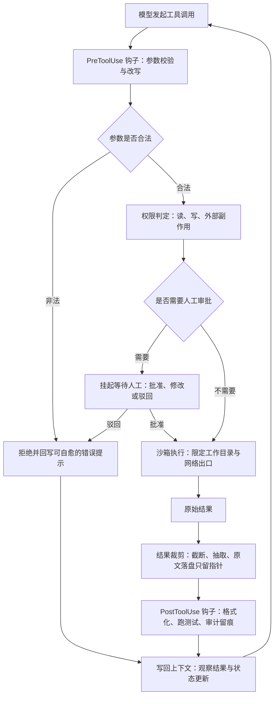

图里我最想强调两个分支：**被拦截的调用也必须写回上下文**，否则模型不知道自己被拒了，会一遍遍重试；**需要审批的调用是挂起而不是失败**，人工批准后要能原地继续。

---

## 7 Agent 架构选型：ReAct、Plan and Solve、Reflection

架构选型不是"哪个更先进"的问题，而是"**任务的不确定性在哪一段**"。不确定性在环境里，就边走边看；在拆解上，就先规划；在质量上，就加审查。

### 7.1 ReAct：边想边做

ReAct 的循环是"观察 → 判断下一步 → 调工具 → 看结果 → 再判断"。它的强项是**下一步依赖上一步结果**的任务：跨十几个文件排查一个 bug、在陌生仓库里找某段逻辑在哪实现、做开放式检索。这类任务事先列不出计划，因为第 3 步做什么取决于第 2 步读到了什么。

代价有两个：一是**目标偏移**，二十轮后很容易从"修这个 bug"漂到"顺手重构这个模块"；二是**成本不可预测**，开始时估不出它要跑多少轮。所以纯 ReAct 我只在两种情况下用：任务很短，或者处在探索阶段、目的就是先摸清情况。

### 7.2 Plan and Solve：先列计划再执行

先出一份任务清单，再逐个执行。它最大的价值不是"计划写得漂亮"，而是把"现在做什么、下一步是什么、还剩多少"从模型脑子里搬到 Harness 能管理的显式状态里。做 20 页 PPT、写调研报告、批量清洗 200 个文件，阶段事先能看清，就该先规划。

代价是**计划本身可能是错的**：计划在信息最少时制定，执行到第 5 步才发现第 2 步的假设不成立。所以必须配一条**重规划通道**——任务失败两次或关键假设不成立，就允许回到 Planner 改计划。

计划粒度也很关键：**每个任务小到一个上下文窗口能做完**，且有独立可检查的产物。"研究竞品"太大，"检索三家竞品的定价页整理成表格"就正好。

### 7.3 Reflection / Critic：让它自己回头看一眼

结构是"执行 → 产出 → 审查 → 反馈 → 修订"，在有客观标准的场景收益最大：代码 Review、事实核查、版式检查、测试覆盖判断。

最危险的失败模式是**震荡**：Agent 觉得错了改一版，再看又觉得原来那版对，改回去，无限来回。所以工程化的 Reflection 一定要有四件东西：最大轮数（我一般给 1 到 2 轮）、能程序化成 pass/fail 的评测标准、成本预算、以及"两轮无改善就交付并标注问题"的退出规则。

Critic 用不用同一个模型也是个取舍：同模型便宜但容易自我认同，换模型或给它一份严格检查清单，发现问题的能力明显更强。**能程序化检查的优先用脚本 Hook**——跑一遍 lint 比让模型读代码又便宜又准。

### 7.4 组合与选型：我按三个问题来选

实际系统里这三种很少单独用。最常见的组合是**外层 Plan and Solve、每个任务内部 ReAct、关键节点插 Reflection**：计划保证不跑偏，ReAct 保证单任务能应对环境变化。

| 做法 | 怎么做 | 优点 | 代价 | 适合场景 |
|-|-|-|-|-|
| ReAct | 单循环，观察—判断—行动—再观察 | 灵活、能应对未知环境、实现最简单 | 目标易漂移、轮数与成本不可预测 | 排查 bug、仓库探索、开放式检索 |
| Plan and Solve | 先出任务清单，逐个执行并维护状态 | 状态显式、进度可见、可并行、可恢复 | 计划可能错，需要重规划机制 | 做 PPT、写调研报告、批量清洗 |
| Reflection / Critic | 产出后审查，反馈给执行者修订 | 提升质量下限，能挡住格式与事实错误 | 成本翻倍、可能震荡、需退出条件 | 代码 Review、事实核查、版式检查 |
| 外层 Plan 加内层 ReAct | 计划管方向，单任务内自由探索 | 兼顾稳定与灵活，我的默认选择 | 实现复杂，需要状态层支撑 | 长程任务、多阶段工程任务 |
| Plan 加 ReAct 加 Reflection | 上面这套再加关键节点审查 | 质量最高，适合可验证交付物 | 成本最高，延迟明显 | 对外交付物、代码合并、正式报告 |

选型判断画成流程图，实际决策就是这三问：

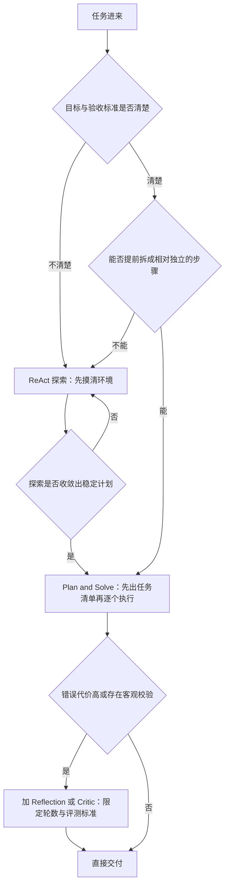

`Q3` 那个自环是故意画的：探索阶段本来就允许多轮，但**必须有轮数上限**，超了就强制进入规划，哪怕计划不完美。否则 Agent 会永远停在"我再看看"的状态里。

---

## 8 多智能体协作（MOE）：什么时候真的需要一群 Agent

先说术语。很多人把"一群专家 Agent"叫 MOE，直觉上没问题，但严格来说 MoE 通常指模型内部的 Mixture-of-Experts 架构；我们讨论的是 Multi-Agent Orchestration。这一章沿用大家习惯的叫法，但心里要清楚说的是**系统层面的多智能体编排**。

### 8.1 先问一句：这个任务真的需要多智能体吗

多智能体有明确代价。Anthropic 在多智能体研究系统的工程博客里提到过一个重要事实：多个 Agent 并行会**显著放大 token 消耗**。付出成倍的成本，换回来的必须是成倍的价值。

我判断值不值得，看三个信号是否同时成立：**能拆**，子任务之间依赖弱；**会脏**，每个子任务会产生大量中间上下文（几十个网页、几百行日志）；**能汇**，结果最后能被归并、比较、写成一份东西。

典型正例是写调研报告：四个 Sub Agent 分别查官方文档、工程博客、竞品实现、公开数据，各自的搜索过程完全不进主上下文，主 Agent 只拿摘要和文件归并。这个场景的收益是**上下文隔离**，比"并行提速"更重要。

典型反例是跨十几个文件改一个 bug。这类任务依赖极强：改了 A 文件的函数签名，B、C、D 都要跟着改，而"为什么这么改"的判断是共享的。拆给三个 Agent 并行，你得到的是三份互相冲突的补丁。

批量数据清洗是个中间态：200 个格式各异的文件要统一成一张表，可以并行，但**不需要"智能体"级别的并行**——更划算的是主 Agent 先在样本上把清洗脚本调通，再用脚本批量跑，只把失败样本交回 Agent。脚本才是最便宜的并行。

### 8.2 拓扑：串行、并行、还是串行加并行

**纯串行**是 A 的产物作 B 的输入（检索 → 写作 → 审校），逻辑清晰，代价是总时长等于各段之和，中间一段错了后面全歪。**纯并行**是 N 个同类 Agent 做同构子任务，墙钟时间短、上下文天然隔离，代价是 token 成倍、结果会重叠冲突。**串行加并行**是真实系统里几乎唯一的答案：阶段之间串行，阶段内部并行。

我实际会这么组织一份调研报告：

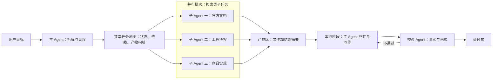

两个细节值得注意：**任务地图和产物区都在 Agent 外面**，不在任何一个上下文窗口里；**校验不通过时回到写作而不是回到检索**，格式问题重跑检索纯属浪费。并行度我一般控制在 3 到 5。

### 8.3 预设专家团队还是主智能体动态调度

两条路线的差别，本质上是**你对任务分布的确定性有多高**。

**预设专家团队**事先定义好 Research、Coding、Reviewer、Data 几个角色，各自带固定的系统提示词、工具集和权限。角色提示词可以打磨得很精细，权限按角色收紧，行为可预测、可回归测试。代价是不够灵活——遇到"分析这批用户反馈并给产品改进建议"这种跨界任务，没有现成角色正好合适。

**主智能体动态调度**由主 Agent 根据任务临时生成子 Agent 的指令、工具集和输出要求。覆盖面广，但**质量方差大**：任务描述含糊会让返工率上升，权限也很难静态审计。

我的选择是混合：高频、高风险的角色做成预设专家（尤其是有写权限、要碰生产的），低频探索类交给动态调度，并给动态子 Agent 一个**权限上限**——继承的工具集只能是主 Agent 的子集，绝不能扩权，否则动态调度会变成权限逃逸的口子。

### 8.4 多智能体的上下文怎么管

核心原则只有一条：**主 Agent 的上下文里只放"地图"，不放"路上的风景"。**

分三层看：**主 Agent** 拿目标契约、任务地图、每个子任务的结论摘要与产物指针——它需要知道"Task 7 完成了、产物在 research_7.md、有一项缺一手来源"，不需要知道子 Agent 读过哪 18 个网页；**Sub Agent** 独立上下文窗口，只拿自己那条任务和对应工具，搜索噪声烂在自己窗口里；**外部共享层**是文件系统、任务地图、Git、产物区，这是唯一的跨 Agent 事实来源。

关于状态外置的收益，Datawhale 对 TencentDB Agent Memory 的实测文章提到一组公开数据：它在长任务上把详细执行过程外置到文件、上下文只留一张任务地图，官方给出的 WideSearch 基准数据是 token 消耗从 2.21 亿降到 8500 万、通过率从 33% 提升到 50%。数字不能直接搬到任何系统上，但它印证了一个反直觉的方向：**少放东西进上下文不只是省钱，还能提升成功率**——超过某个密度后，噪声开始压过信号。

### 8.5 三种通信方式

Agent 之间怎么通信，决定了整个系统的耦合度：

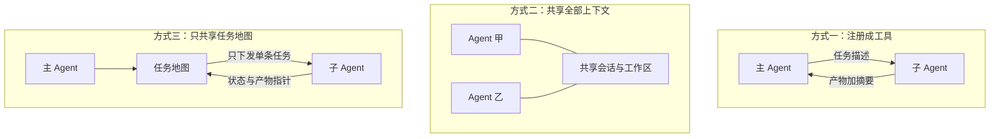

三种方式的耦合度从上到下递减，可控性递增，对任务可拆性的要求也递增。

#### 8.5.1 把 Sub Agent 注册成工具

在主 Agent 眼里，子 Agent 就是一个普通工具：输入任务描述，输出结果。Claude Code 的 Sub Agent 就是这个形态——独立上下文窗口、结果返回主会话，官方也建议把会产生大量日志、搜索结果和文件内容的任务交给子 Agent，从而保护主上下文。

这是我最推荐的默认方案，因为它复用了工具调用那一整套机制：权限判定、超时、重试、结果裁剪、审计都不用重写。代价是子 Agent 内部过程黑盒，只能事后从产物判断。适合并行检索、独立测试、单文件重构。

#### 8.5.2 团队协作场景共享全部上下文

多个 Agent 挂在同一份会话历史上，互相能看到对方说了什么、做了什么，模拟真实团队的白板讨论：一个提方案、一个质疑、一个补数据。

优点是**信息不丢**，适合需要互相纠错的场景，比如技术方案多角度评审。代价也直接：上下文成倍膨胀，每个 Agent 都要为别人的过程付费，还容易"互相附和"。我只在参与者少、讨论本身就是产物时用它。

#### 8.5.3 主 Agent 与 Sub Agent 只共享 Task List

最彻底的隔离：主 Agent 维护完整任务地图，子 Agent 只知道"我这条任务是什么、验收标准是什么、产物写到哪"。

优点是上下文占用最小、可以放心并行、子 Agent 随时能被杀掉重启。代价是**缺少全局判断**：遇到"这个数据源和主任务口径不一致"这类问题，它只能标注不确定性交回去。适合批量数据清洗、大规模并行检索、批量测试与文件转换——任务越同构越划算。

### 8.6 三种回传形态

子 Agent 回传什么，比它怎么被调用更影响整体成本。

| 做法 | 怎么做 | 优点 | 代价 | 适合场景 |
|-|-|-|-|-|
| 完整上下文回传 | 全部消息历史并回主上下文 | 信息零损失，能复盘全过程 | 上下文爆炸，主 Agent 被噪声污染 | 只在调试期排查子 Agent 行为 |
| 只回传产物 | 只返回文件路径或结构化结果 | 最省 token，主上下文干净 | 不知道产物怎么来的、哪里存疑 | 高度机械的同构任务 |
| 产物加执行摘要 | 产物指针加状态、结论、不确定项、下一步 | 成本可控又保留判断所需信息 | 摘要可能失真，需要约定字段 | 研究、写作、改代码类任务 |

#### 8.6.1 完整上下文回传

把子 Agent 的全部消息历史并回主上下文。信息零损失，但主 Agent 要为别人的搜索过程付费，长任务里几乎必然把窗口撑爆。我只在调试期用它，看子 Agent 到底在哪一步走偏。

#### 8.6.2 只回传产物

只给文件路径或结构化结果，主上下文最干净。代价是主 Agent 不知道产物怎么来的、哪里存疑，只能默认它是对的。适合批量格式转换这类同构任务。

#### 8.6.3 产物加执行摘要回传

这是我的默认选择。关键在于**把回传格式定成协议**，而不是让子 Agent 自由发挥：

```yaml
status: done
artifact: research_07.md
key_findings:
  - 官方文档明确区分权限判定与沙箱执行
  - 未找到关于工具数量上限的官方建议
uncertainty:
  - 其中一条数据只有二手来源
next_action:
  - 建议主 Agent 对该数据做一次交叉核验
cost:
  tool_calls: 14
```

有了 `uncertainty` 和 `next_action`，主 Agent 才有机会做出"这条要再核一遍"的判断。没有它们，主 Agent 只能默认所有子任务都做对了——这是误差积累最常见的入口。

### 8.7 三个原则：最小权限、通信分级、成本匹配

**最小权限**：每个 Agent 只拿完成任务必须的工具。检索 Agent 给搜索和读取就够，不要顺手带上写文件、发邮件、连生产库。因为**风险面等于所有 Agent 权限的并集**——给十个子 Agent 都开了删除权限，就有十个地方可能删错东西。

**通信分级**：主 Agent 看全局任务与目标契约；Worker 只看自己那条任务；Reviewer 只看产物加验收标准。最后一条很关键，让 Reviewer 看到"作者的思考过程"会让它更容易被说服，失去审查价值。

**成本匹配**：规划和硬推理用最强模型；检索、抽取、分类用中档模型；记忆整理、摘要、格式判定用轻量模型；能写成脚本的检查根本不该用模型。这套配置带来的成本下降，往往比换一个更便宜的主模型有效得多。

---

## 9 安全沙箱与 Human in the Loop

安全要拆成两个不同的东西：**权限决定"能不能做"，沙箱决定"即使做了最多能碰到哪"**。Claude Code 官方文档也是这么区分的——权限在工具运行前判断是否允许，沙箱在操作系统层限制一个已经在跑的命令能访问哪些文件和网络资源。两层必须同时存在。

### 9.1 沙箱的边界：工作目录、网络、凭证

**工作目录**：读写限制在明确目录内。坑比想象的多——软链接可以指到目录外、`..` 路径穿越、Git 配置里能塞钩子脚本、临时目录常被漏掉。我的做法是**允许清单而不是禁止清单**，只声明可写路径前缀，路径先规范化再判断。

**网络**：默认拒绝出站，按域名放行。不只是防止乱下东西，更重要的是**防数据外泄**——一个能读代码仓库、又能任意发 HTTP 请求的 Agent，可以把代码 POST 到任何地方。

**凭证**：最值得抄的是 Anthropic 在 Managed Agents 里的思路——Harness、执行沙箱和会话分离，敏感凭据保存在沙箱外部，由代理层或 Vault 在真正调用外部服务时完成认证，Agent 运行的代码不直接接触 Token。也就是说，**Agent 拿到的是"能调这个 API 的能力"，不是"这个 API 的密钥"**，即使它被诱导打印环境变量，泄露的也不是真凭证。

### 9.2 拦截器：在哪一层拦、拦什么

拦截可以放在五层，越靠下越可靠，越靠上越灵活：

1. **提示层**：在提示词里写"不要做 X"。最便宜但完全不可靠，只算引导。
2. **工具参数层**（我的主战场）：拿到结构化参数后判定，能看到完整意图（写哪个文件、跑什么命令、SQL 是 select 还是 delete），也能给出可读的拒绝原因让模型自愈。
3. **进程与系统调用层**：沙箱在 OS 层限制文件与网络访问。最可靠，模型绕不过去；但它只知道"某进程要打开某路径"，给不出业务层解释。
4. **网络出口层**：统一出口做域名与协议管控，顺便审计。
5. **产物层**：在提交、发布、发送之前再检查一次，适合"格式不对不许合并"、"含密钥不许推送"。

拦什么？我按后果分三类：**不可逆动作**（删除、覆盖、生产变更、支付、对外发消息）、**扩权动作**（改权限配置、写 CI 配置、装可执行文件、改 Git 钩子）、**外泄动作**（读凭证目录、大批量外发数据）。这三类之外尽量放开——**拦得太多，Agent 会退化成一个不停问你问题的聊天机器人**。

### 9.3 什么时候必须停下来找人：提权审批

腾讯云开发团队把这件事叫 human in the loop，这个叫法很准：人不是在旁边看着，而是**被编排进循环里的一个节点**。我的判定逻辑：

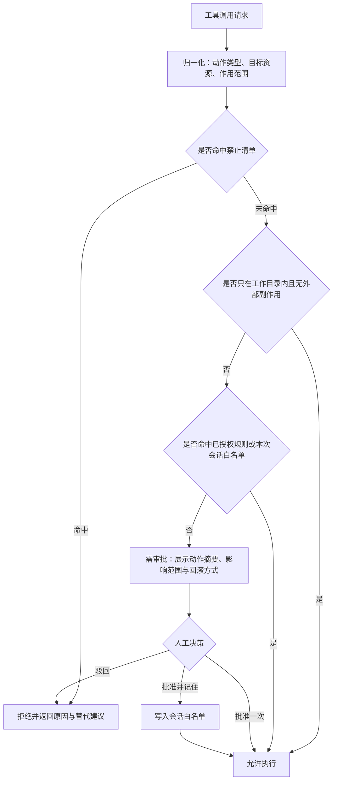

三个出口的设计要点：**拒绝要给替代建议**（"不能直接删除，可以移到 trash 目录"），否则模型会换个写法再试；**审批要给足决策信息**，光显示一行命令让人点同意，人的判断质量并不比模型高；**"批准并记住"必须限定作用域**，只在本次会话、本目录、本类动作内有效。

还有个容易忽略的问题是**审批点密度**。一个任务弹二十次审批，用户会开始无脑点同意，安全性反而归零。所以我更关注"平均每个任务弹几次"，超过 3 次就说明分级有问题，该把某些动作沙箱化而不是审批化。

### 9.4 为什么我说这些策略必须由产品来定

工程能做的是**提供机制**：拦截点在哪、分级怎么表达、审批怎么展示、白名单作用域怎么控。但"哪些动作要审批"这个取舍，本质上是**风险偏好和用户信任曲线**的问题，工程判断不了。

几个例子。给专业开发者的编码 Agent，工作目录内写文件必须自动放行，否则没法用；给非技术用户的办公助手，覆盖原始文件哪怕在工作目录内也该确认一次。批量清洗如果承诺"原始数据永不修改"，全自动没问题；允许原地覆盖，就得在第一次覆盖前拦一次。发消息给外部人几乎都该拦，因为不可撤回。

产品还要定三件事：**默认档位**、**用户可调范围**、**信任成长曲线**——本质上是"我们愿意为用户承担多少风险"。

### 9.5 一张权限分级表

下面这套分级是**我自己设计时用的**，不是业界标准。它的价值是：把动作映射到档位，策略绑在档位上，而不是给每个工具单独写规则。

| 档位 | 典型动作 | 沙箱要求 | 默认策略 | 失败后的补救 |
|-|-|-|-|-|
| L0 只读 | 搜索、读公开文档、读工作目录内文件、代码检索 | 只读挂载 | 自动执行 | 无需补救 |
| L1 沙箱内写 | 工作目录内写文件、跑测试、装临时依赖 | 目录与网络白名单 | 自动执行，动作留痕 | 版本控制回滚 |
| L2 外部读 | 查内部系统、拉工单、读数据库、调只读 API | 凭证由代理层持有 | 自动执行，按频率限流 | 无副作用 |
| L3 外部写 | 提 MR、写数据库、发邮件、改配置、部署预发 | 凭证不落沙箱 | 规则判断，命中风险规则则审批 | 需要显式撤销流程 |
| L4 高危 | 生产变更、删数据、改权限、支付、对外发消息 | 独立通道 | 一律 human in the loop | 需事前备份与回滚预案 |
| L5 禁止 | 改审计日志、关安全策略、读凭证明文、绕过沙箱 | 不提供工具 | 拒绝并告警 | 视为异常事件排查 |

这张表真正的用处是**让工具接入有统一问法**：新接一个 MCP，先问它暴露的每个工具落在哪一档，落 L3 以上的默认不注入、按需加载且必须走审批。

---

## 10 长程任务：Harness 真正的压力测试

长程任务（long horizon task）是近几年 Agent 领域最核心的议题，也是 Harness 设计好坏最诚实的照妖镜。短任务里很多缺陷会被模型的聪明掩盖，跑到第 40 个 task 时，任何一处状态管理没做好都会暴露。

Anthropic 在长时运行 Agent 的文章里有个类比我很认同：复杂任务往往无法在单个上下文窗口内完成，而每个新会话如果没有前一次工作的可靠状态，就像"换班的新工程师完全不知道上一班做了什么"。**长程任务的核心问题不是"模型能不能想那么远"，而是"系统能不能交接清楚"。**

### 10.1 什么样的任务算长程任务

我用四个条件粗略判断，满足两条以上就该按长程任务设计：任务到几十个量级且互有依赖；每个任务都有实质的输入、工具调用和输出；总执行跨越多个上下文窗口甚至跨会话；中途一定会出现失败、返工、目标细化。

几个真实形态：把一个中型项目从框架 vN 升到 vN+1，几十个文件要改，每改一批要跑测试；整理覆盖十几家公司的行业调研，每家要查资料、抽指标、交叉核验；清洗 500 个来源不一的数据文件，异常值规则边做边补。共同点是：**不可能在一个上下文窗口里做完，也不可能靠一次规划就规划对。**

### 10.2 三个痛点

#### 10.2.1 上下文爆炸

任务越长，历史消息、工具输出、文件内容、Agent 间消息都在单调增长。如果唯一手段是不断压缩，就会变成"摘要的摘要的摘要"，每层都在丢信息，而且丢了什么事后完全不知道。更隐蔽的是**成本的非线性**：上下文越长，每轮输入 token 越多，第 40 轮的单轮成本可能是第 5 轮的十几倍。

#### 10.2.2 误差积累

短任务里一次错误只影响一轮，长任务里它会沿依赖链传染：Task 3 抽错一个字段口径，Task 7 基于它做聚合，Task 15 基于 Task 7 出图表，最后整体是错的，表面还看不出来。最难的不是"怎么修错"，而是**怎么知道错了**——长程任务的设计重心必须从"怎么继续"转向"**怎么证明当前这一步是对的**"。

#### 10.2.3 目标偏移

Agent 跑了几十轮之后，很容易从"做一份给产品经理看的 Harness 入门 PPT"漂成"写一篇很深入的 Agent 技术论文"。机制很清楚：**目标只在第一轮出现过一次，之后每轮最新的工具结果占比越来越高，目标的相对权重被稀释到接近于零。**

### 10.3 对应的三组解法

#### 10.3.1 状态外置与任务地图

最有效的一条：**让上下文窗口不再承担"完整会话状态"的职责**。完整状态放外面（文件、Git、任务地图），上下文只是每轮按需装载的工作集。落法是一份显式的任务地图：

```yaml
goal_ref: goal.md
tasks:
  task_07:
    status: done
    artifact: extract_07.md
    key_result: 抽出 12 项指标，其中 2 项缺来源
  task_08:
    status: doing
    depends_on: [task_07]
  task_09:
    status: pending
    depends_on: [task_08]
```

任务之间的依赖是一张 DAG，这在**规划层面**成立。但要区分：**运行时的执行图会有环**——重试、回滚、重规划都会让执行流回到之前的节点。规划是 DAG，执行不是，很多状态机 bug 就出在把它们当成同一张图。前面提到的 TencentDB Agent Memory 走的正是这个思路。

#### 10.3.2 可验证的 checkpoint 与回滚

对付误差积累，唯一靠得住的办法是**每个批次结束时做一次能程序化判断的校验，通过才落 checkpoint**。

最危险的完成条件是"你觉得做好了就结束"。更好的是把验收翻译成检查项：PPT 场景是"文件生成成功、页数 18 到 22、每页有标题、无文字溢出"；代码场景是"编译通过、单测通过、lint 无错、diff 只涉及计划内文件"；数据清洗场景是"行数与源文件一致、关键字段无空值、抽样 20 条人工可读"。**越能变成程序检查的东西，长任务就越稳。**

checkpoint 至少要存任务地图快照、产物版本（最好就是一个 git commit）、关键决策和本批次校验结果。回滚粒度我建议**按批次而不是按任务**：单任务回滚往往不足以消除污染（下游已经读过错的产物），整体重来又太贵，一个批次 3 到 5 个任务比较舒服。

#### 10.3.3 目标契约与定期复读

对付目标偏移，我的做法是把目标写成一份**结构化契约**，并在关键时刻重新注入：

```yaml
goal: Harness Engineering 入门 PPT
audience: AI 产品经理，非工程背景
constraints:
  - 20 页左右
  - 每页至多一个技术概念
  - 不出现代码
deliverable: harness.pptx
done:
  - 页数 18 到 22
  - 每页有标题且无溢出
  - 至少 3 张架构图
non_goals:
  - 不写技术论文
  - 不做模型原理推导
```

`non_goals` 是我加进来之后收益最明显的字段——**目标偏移往往不是因为没说要什么，而是因为没说不要什么**。复读时机很明确：上下文压缩后、新会话恢复后、创建子 Agent 时、切换阶段时、更换模型时。这些都是"上下文被重建"的时刻，不主动重注入，目标就会在重建中被稀释掉。

### 10.4 Loop Engineering 和 /loop：解决了什么，门槛在哪

Claude 提出的 loop engineering，在我的理解里一定程度上就是为长程任务设计的：Harness 解决"如何工作"，Loop 解决"如何持续工作"——什么时候再次唤醒 Agent、怎么判断完成、什么时候必须停。

`/loop` 有一部分功能正是针对这个问题的。这里要说清楚：**它不是一个简单的定时触发器**，而是让模型持续朝目标推进的调度与唤醒机制，每一轮之后判断目标是否达成，没达成就带着状态继续推进。

但**门槛很高**。要用好它，用户自己得先想清楚三件事：一是**目标怎么描述**，要具体到能被判断，"升级到 vN+1 且测试全绿"可判断，"把代码质量搞好"不可判断；二是**退出标准**，时间上限、轮次上限、目标完成条件都要给，缺一个要么提前放弃要么无限烧钱；三是**评测指标**，凭什么说这一轮比上一轮更接近目标，没有客观指标模型就会用"我觉得差不多了"结束，而这恰恰是长任务里最不该信的判断。

这三件事对普通用户门槛都不低——本质上是**要求用户先做一遍需求工程和验收设计**。所以我的判断是：这类能力短期内更适合工程角色使用，产品化的方向应该是**帮用户把目标和验收标准问出来**，而不是把一个裸的循环开关直接丢给用户。

### 10.5 长程任务的执行与恢复闭环

把上面所有东西装到一起，能真的跑长任务的 Harness 大概是这个形状：

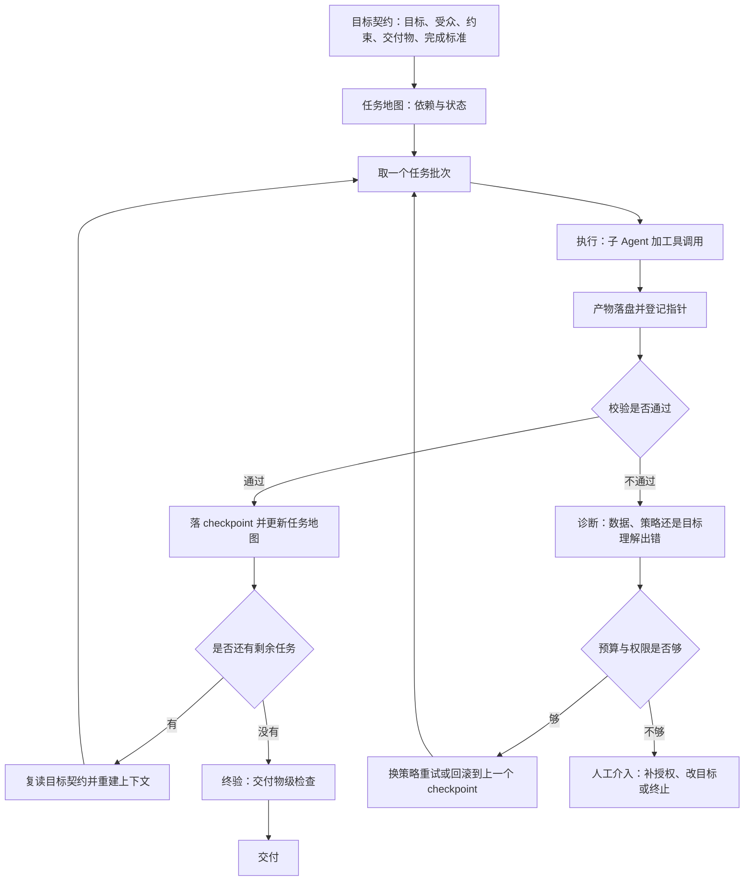

图里最关键的三条边：**校验不通过先走诊断而不是直接重试**（不知道为什么错就重试，大概率错第二遍）；**每个批次开始前都要复读目标契约**，这是抗偏移成本最低的一招；**预算或权限不足时的出口是人，不是失败退出**——跑了两小时后因为缺一个授权而整体失败最浪费，正确做法是挂起、通知、等人补齐后从 checkpoint 继续。

---

## 11 写在最后：一份 Harness 设计自检清单

到这里，记忆、上下文、工具、架构选型、多智能体、安全沙箱、长程任务都过了一遍。最后我把它压缩成一份能直接拿去用的东西。

### 11.1 我认为一个 Harness 至少要回答的 20 个问题

这份清单按层分组，用法不是"全部答是就合格"，而是**答不上来某一条时，那里就是你系统里最可能出事的地方**。

| 编号 | 问题 | 为什么这个问题重要 |
|-|-|-|
| 1 | 系统提示词里哪些是常驻的，哪些能外置到 Skill | 常驻内容每轮都在花钱，也在争夺模型注意力 |
| 2 | 提示词里有没有互相冲突的规则 | 冲突会让行为随机化，是最难复现的 bug |
| 3 | 工具的错误信息模型看得懂吗 | 决定模型能不能自愈，直接影响成功率 |
| 4 | 大体积工具输出怎么裁剪 | 上下文爆炸的第一大来源 |
| 5 | 破坏性工具幂等吗，能回滚吗 | 长任务一定会重试，不幂等就会重复造成副作用 |
| 6 | 注册了多少工具，哪些必定注入 | 数量直接决定选择错误率和常驻成本 |
| 7 | 按需加载判错时的兜底路径是什么 | 没有兜底，Agent 会声称自己"做不到" |
| 8 | 哪些规则该写成 Hook 而不是提示词 | 确定性检查交给代码，比反复叮嘱模型可靠 |
| 9 | 模型说做完了的时候有没有验收 | 没有验收，"我做完了"就是无法核实的自述 |
| 10 | 单任务用 ReAct 还是先规划 | 决定成本可预测性和目标稳定性 |
| 11 | 计划错了能不能改 | 不能重规划，就会硬执行错误路径 |
| 12 | Reflection 的最大轮数和退出条件是什么 | 缺退出条件必然震荡，成本与延迟失控 |
| 13 | 这个任务真的需要多智能体吗 | 多智能体成倍放大 token 消耗，收益要先说清 |
| 14 | 主 Agent 上下文里是地图还是过程 | 主上下文装进过程细节，长任务立刻退化 |
| 15 | 子 Agent 回传什么，格式定了吗 | 回传里的不确定项字段，是防误差积累的关键 |
| 16 | 每个 Agent 的工具集是不是最小集 | 风险面等于所有 Agent 权限的并集 |
| 17 | 权限和沙箱是两层还是一层 | 只有权限没有沙箱，等于拦人却不锁保险柜 |
| 18 | 凭证是 Agent 直接持有还是代理层持有 | 决定模型被诱导时会不会泄露真实密钥 |
| 19 | 一个任务平均弹几次审批 | 弹太多用户会无脑同意，安全性归零 |
| 20 | 完成标准能被程序判断吗 | 这是长程任务唯一的稳定锚点 |

如果只能挑三条，我会挑第 4、第 14 和第 20：裁剪、地图化、可验证完成。

### 11.2 我的三个判断

**第一，Harness Engineering 是功能架构层面的事，不是技巧层面的事。** Prompt Engineering、Loop Engineering、Graph Engineering 都更偏技术手段，而 Harness 讨论的是"系统由哪些模块组成、怎么连、每个模块的策略怎么选"。这也是我坚持画架构图而不是列原则的原因——**功能架构只有画出来，才能看出哪里缺了一块**。

**第二，Agent = LLM + Harness 是一个工程心智模型，不是行业标准定义。** 它的价值是把讨论从"模型够不够聪明"拉到"我们有没有把环境、工具、状态、反馈设计好"。模型决定能力上限，Harness 决定这个上限能兑现多少。

**第三，Harness 里几乎每个技术点，最后都会变成一个产品决策。** 拦不拦、什么时候找人、目标怎么问出来、并行到什么程度、成本花在哪一层——都不是"技术上能不能做"，而是"我们愿意为用户承担多少风险、花多少钱、要多快"。所以它值得产品和架构坐在同一张桌子上讨论。

### 11.3 参考资料

- [OpenAI, Harness engineering: leveraging Codex in an agent-first world](https://openai.com/index/harness-engineering/) —— 支撑本文核心视角：限制 Agent 的往往不是模型能力，而是环境、工具、结构与反馈回路。
- [Claude Code Docs, How Claude Code works](https://code.claude.com/docs/en/how-claude-code-works) —— 支撑"模型负责推理、harness 负责提供工具与执行环境"这一分工。
- [Claude Code Docs, Create custom subagents](https://code.claude.com/docs/en/sub-agents) —— 支撑 8.5.1：Sub Agent 独立上下文窗口、结果回传主会话、适合承载大量日志与搜索结果。
- [Claude Code Docs, Connect Claude Code to tools via MCP](https://code.claude.com/docs/en/mcp) —— 支撑 6.3.1 对 MCP 的定位：连接外部工具、数据库与 API 的标准接口。
- [Claude Code Docs, Extend Claude with skills](https://code.claude.com/docs/en/skills) —— 支撑 6.3.2：Skill 是可复用任务知识，按需加载。
- [Claude Code Docs, Hooks reference](https://code.claude.com/docs/en/hooks) —— 支撑 6.6 中 `PreToolUse`、`PostToolUse`、`Stop` 的用法。
- [Claude Code Docs, Configure the sandboxed Bash tool](https://code.claude.com/docs/en/sandboxing) —— 支撑第 9 章把权限判定与操作系统层沙箱拆成两层。
- [Claude Code Docs, Explore the context window](https://code.claude.com/docs/en/context-window) —— 支撑 6.4 与 8.4：工具名、Skill 描述、Hook 输出、子 Agent 返回都在占上下文。
- [Anthropic, How we built our multi-agent research system](https://www.anthropic.com/engineering/multi-agent-research-system) —— 支撑 8.1 的成本前提：多智能体并行会显著放大 token 消耗。
- [Anthropic, Effective harnesses for long-running agents](https://www.anthropic.com/engineering/effective-harnesses-for-long-running-agents) —— 支撑第 10 章的"换班交接"类比与小批次加 checkpoint。
- [Anthropic, Scaling Managed Agents: Decoupling the brain from the hands](https://www.anthropic.com/engineering/managed-agents) —— 支撑 9.1 的凭证设计：凭据存在沙箱外部，由代理层完成认证。
- [LangChain, 3 Years of Graph Engineering with LangGraph](https://www.langchain.com/blog/3-years-of-graph-engineering-with-langgraph) —— 支撑 8.2 与 10.3.1 对执行拓扑、以及规划图与运行时执行图的区分。
- [Datawhale，腾讯把 Agent 记忆系统开源了，TencentDB Agent Memory 实测](https://mp.weixin.qq.com/s/Rwf1z89_0uUt1pixe_ohwg) —— 支撑 8.4 与 10.3.1 的状态外置判断，及 WideSearch 上 token 从 2.21 亿降到 8500 万、通过率从 33% 提升到 50% 的公开数据。
